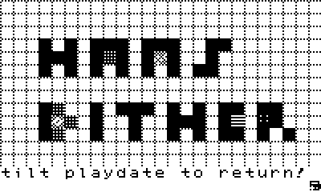
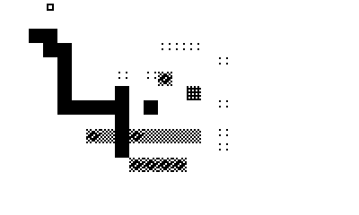
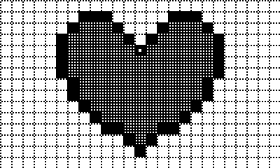
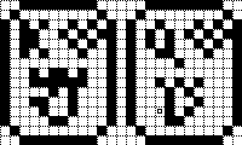
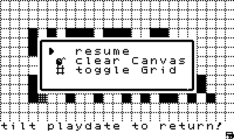
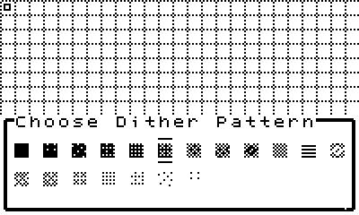

a pixelart editor made in playdate's pulp

# Hans Dither

## Hans-Dither: A Minimalist Pixel Editor for Playdate

Hans-Dither is a pixel editor designed to do just enough, and that’s the point.

**How to use:**
- Press **A** to place a pixel.
- Press **B** to remove it.
- Use the **crank** to select patterns.
- Rotate the Playdate 90 degrees to return to the menu.

That’s all you need to start pixeling. When you’re done, save your work with a screenshot.

This is Hans-Dither.

My first project using Pulp, Panic’s low-code editor for Playdate, was more than just fun. It’s something I’ll keep growing, one pixel at a time.

---

## Download & More Info

[Hans Dither on itch.io](https://merlinbecker.itch.io/hans-dither)

---

## Screenshots

	
	
	
	
	

