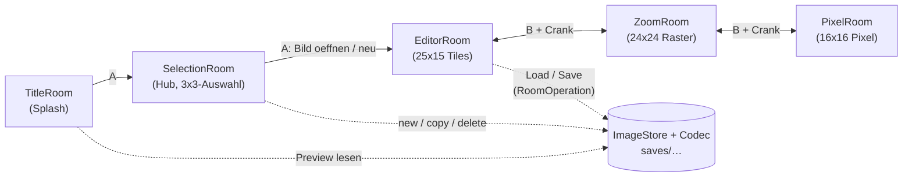

# 5. Bausteinsicht

## 5.1 Whitebox Gesamtsystem

Das Gesamtsystem besteht aus einer Room-Orchestrierung mit drei Editierstufen und einem nativen Persistenzpfad: TitleRoom -> SelectionRoom -> EditorRoom <-> ZoomRoom <-> PixelRoom; Speichern und Laden laufen ueber ImageStore/ImageStoreCodec (PDI-Tilemap + Positions-JSON, AD-017).



Die Navigation ist bewusst gerichtet: Der TitleRoom ist eine Einbahnstrasse (nur Splash), der SelectionRoom ist die Basis-Ebene — B fuehrt dort nicht zurueck. Zurueck aus dem Editor geht es ausschliesslich ueber "save + exit" (Systemmenue); innerhalb der Zoomkette navigiert B+Crank in beide Richtungen.

### Enthaltene Bausteine

| Baustein | Verantwortung |
|---|---|
| main.lua | Initialisierung, Room-Verdrahtung, zentrales playdate.update, Terminate-Hook (Commit-Kette der Zoomstufen + Save des offenen Bildes). |
| TitleRoom | Einstieg/Startbildschirm; fuehrt zum SelectionRoom. |
| SelectionRoom | Bild-Auswahlscreen (3x3-Raster mit maskierten Thumbnails, endloses Scrollen); Anlage/Kopie/Loeschen ueber Systemmenue; setzt EditorRoom:setImage(id) und wechselt direkt in den Editor (AD-018). |
| EditorRoom | Haupteditor: 25x15-Raster aus 16x16-Tiles auf nativen 400x240 via SDK-tilemap (AD-016). Cursor (D-Pad, SDK-keyRepeatTimer), A = Zeichnen/Toggle, B = Pipette, Crank = Frame-Verwaltung (max. 12, Rotation), B+Crank = Zoomtrigger, Systemmenue (save + exit, delete frame, show grid), Dedup-Commit-Pfad applyTileEdits. |
| ZoomRoom | Mittlere Zoomstufe: 3x3-Tile-Kontext als 24x24-Malraster, eine Zelle = 2x2 native Pixel; Commit geaenderter Slots an EditorRoom:applyTileEdits; "All Similar" schreibt in-place in die Imagetable. |
| PixelRoom | Innerste Zoomstufe: ein Tile mit echten 16x16 Pixeln; Menueaktionen All Similar und Invert; Rueckgabe an ZoomRoom. |
| ImageStore | Bildverwaltung: Index (saves/index), Anlage/Kopie/Loeschen, Preview-Zugriff. |
| ImageStoreCodec | Coroutine-basierte Save-/Load-Operationen: PDI-Sheet (deduplizierte Tiles) + frames.json (Positionen je Frame), FNV-1a-hashTile, Slicing zur Laufzeit-Imagetable inkl. hashIndex. |
| loadingBar | Einheitliches Overlay fuer Lade-/Speicherfortschritt (Titel, Phasen-Detail, Fehlerstatus). |
| RoomOperation | Gemeinsame Coroutine-Orchestrierung fuer room-lokale Langlaeufer; reicht Phasen-Yields ans Overlay und das Coroutine-Ergebnis an onComplete durch. |
| Bauchbinde | Wiederverwendbare UI-Komponente fuer Hinweisbaender (Frame-Anzeige "Frame n/m", Fehlerstatus). |
| PencilCursor | Cursor-Overlay fuer alle Editierstufen. |
| tests/headless_tests.lua | SDK-freie Regressionstests (normaler Lua-Interpreter, strikte Playdate-Mocks); fangen insbesondere die Fehlerklasse "nicht existierende SDK-API" vor dem Simulator-Lauf ab. |
| Tools/Importer (index.html, app.js) | Historisches Browser-Tool fuer PNG-Import in Pulp-JSON; mit dem v0.3.0-Format nicht kompatibel (bewusst, R-14). |

### Entfallene Bausteine (v0.2 -> v0.3.0)

| Entfallen | Ersatz |
|---|---|
| TileRoom, TileRoomEditor, TileRoomPersistence | EditorRoom (Neuaufbau ohne Pulp-Kopplung, Offscreen-Buffer, Tile-Picker und EditMode-Automat) |
| LoadRoom, LoadRoomGrid | SelectionRoom (AD-018) |
| PulpGameIO, PulpGameIOShared, PulpGameIOSave, PulpGameIOLoad | ImageStore/ImageStoreCodec (AD-017) |
| GameRoom | Durch SelectionRoom ersetzt (AD-018); Datei entfernt. |

### Wichtige Schnittstellen

- switchRoom(newRoom): room-uebergreifende Navigation inklusive Input-Handler-Wechsel.
- EditorRoom:setImage(id) / entered(): Kontextsetzung durch SelectionRoom; das Laden laeuft asynchron als RoomOperation beim Room-Eintritt.
- EditorRoom:applyTileEdits(edits): Ruecknahme geaenderter Zoom-Slots ueber den Dedup-Pfad (hashIndex + Pixelvergleich); schreibt nur den aktiven Frame.
- EditorRoom:getImageData(): Zugriff fuer den Terminate-Hook in main.lua.
- ZoomRoom:setFromEditorContext(ctx): Uebernahme des 3x3-Kontexts (Slots, 24x24-gridState, showGrid, imageData-Referenz).
- ZoomRoom:setNewTile(tile) / updateExistingTile(tile, idx): Rueckgabe aus PixelRoom (Standard- bzw. All-Similar-Pfad).
- ZoomRoom:commitForTerminate() / PixelRoom:commitForTerminate(): Commit ohne Room-Wechsel fuer den Terminate-Hook.
- ImageStoreCodec.newSaveOperation(imageData) / newLoadOperation(id): Coroutine-Fabriken fuer RoomOperation.
- RoomOperation:start()/resume(onError): generischer Ablauf fuer Coroutine + loadingBar-Lifecycle inkl. Fehlerpfad.

## 5.2 Ebene 2

### 5.2.1 Whitebox main.lua

Verantwortung:
- Imports aller Rooms und CoreLibs
- Verkabelung: TitleRoom -> SelectionRoom -> EditorRoom <-> ZoomRoom <-> PixelRoom
- Lebenszyklusverwaltung und Terminate-Hook

Interne Logik:
- currentRoom als Single-Point-of-Truth fuer Update und Input.
- Display-Scale ist auf 1 gesetzt; alle Rooms arbeiten nativ auf 400x240.
- Beim Raumwechsel werden Input-Handler ausgetauscht, danach entered() aufgerufen.
- gameWillTerminate(): aktive Zoomstufen committen zuerst (PixelRoom -> ZoomRoom -> EditorRoom), dann wird das offene Bild synchron ueber ImageStoreCodec gespeichert.

### 5.2.2 Whitebox SelectionRoom

Verantwortung:
- Auswahl, Anlage (mit Keyboard-Namenseingabe), Kopie und Loeschen von Bildern.
- Vorschaubilder aus dem ImageStore laden und als maskierte Kreis-Thumbnails darstellen.
- Uebergang in den Editor via setImage(id) + switchRoom.

Interne Logik:
- Basis-Ebene der Navigation: B fuehrt nicht zum TitleRoom zurueck; B schliesst nur Loesch-Dialog bzw. Keyboard.
- Selektion laeuft ausschliesslich ueber setSelectedIndex() und ist damit immer mit der Gridview-Selektion (setSelection/scrollToCell) synchron; Navigation klemmt an vorhandenen Eintraegen.
- Namenseingabe ueber das SDK-Keyboard: Commit/Abbruch via keyboardWillHideCallback(ok); waehrend das Keyboard sichtbar ist, wird jeder Frame neu gezeichnet (Raster + Eingabezeile unten links).
- Thumbnail-Cache mit Negativ-Eintraegen (false = "Preview fehlt"), damit fehlende Previews nicht pro Frame von der Platte gelesen werden.

### 5.2.3 Whitebox EditorRoom

Verantwortung:
- Haupt-Arbeitsflaeche: 25x15-Tilemap auf voller Displayflaeche, Cursor, Grid-Overlay.
- Eingabesemantik gemaess AD-019 (siehe 8.1): A zeichnet/toggelt, B pipettiert, Crank verwaltet Frames, B+Crank zoomt.
- Frame-Verwaltung mit Kopie-Semantik, harter 12er-Grenze und beidseitiger Rotation; "delete frame" via Systemmenue (letzter Frame gesperrt).
- Autosave: "save + exit" startet die Save-Operation und wechselt nach Erfolg zum SelectionRoom; Fehler zeigen einen Status, der Editor bleibt bedienbar.

Besonders relevante interne Teile:
- tilemap:setTiles(frames[currentFrame], 25) als einziger Frame-Wechsel-Pfad (keine Bildkopien im Update-Pfad).
- appendTileImage() laesst die Imagetable beim Malen wachsen (mit Neuaufbau-Fallback) und haelt den hashIndex konsistent.
- Eingaben sind waehrend laufender Save-/Load-Operationen blockiert (inkl. Menueaktionen).

### 5.2.4 Whitebox ZoomRoom

Verantwortung:
- 3x3-Tile-Kontext als 24x24-Malraster darstellen (Zelle = 2x2 native Pixel, Anzeige 10 px/Zelle, 240x240 zentriert).
- Slot-Mapping inkl. out-of-bounds-Behandlung (Randslots nicht editierbar).
- Aenderungen nur bei Differenz als Edit-Liste an EditorRoom:applyTileEdits zurueckgeben.
- showGrid-Status aus dem EditorRoom uebernehmen (gestrichelte Zellgrenzen).

Interne Logik:
- gridState (24x24, boolesch) plus baselineGrid als Dekodier-Snapshot; Nutzeraenderungen = Abweichungen von der Baseline.
- buildWorkingImage() brennt nur geaenderte Zellen als 2x2-Bloecke ins Basisbild und erhaelt damit feinere Pixel-Details aus dem PixelRoom.
- "All Similar" aus dem PixelRoom schreibt das Tile in-place in die Imagetable (wirkt auf alle Verwendungen ueber alle Frames, FR-013-Ausnahme) und fuehrt den hashIndex nach.

### 5.2.5 Whitebox PixelRoom

Verantwortung:
- 16x16-Pixelbearbeitung eines ausgewaehlten Tiles (Anzeige 14 px/Zelle, 224x224 zentriert).
- Rueckgabe entweder als bearbeitetes Tile (Dedup beim Commit) oder in-place-Aenderung (All Similar).

Interne Logik:
- gridState als boolesches Pixelraster; Menueaktionen All Similar (Checkmark) und Invert.
- B+Crank rueckwaerts uebergibt an ZoomRoom; vorwaerts ist an der innersten Stufe ein No-op.

### 5.2.6 Whitebox ImageStore / ImageStoreCodec

Verantwortung:
- ImageStore: Indexdatei, Bildverwaltung (create/copy/delete/list), Preview-Zugriff.
- ImageStoreCodec: phasenweises Speichern (Dedup, Sheet, Frames, Bilddaten, Preview, Index) und Laden (Frames lesen, Sheet lesen, Slicing, Validierung) als Coroutinen.

Interne Logik:
- Ablage je Bild unter saves/<id>/: sheet.pdi (deduplizierte 16x16-Tiles), frames.json (375 Indizes je Frame), preview.pdi.
- FNV-1a-hashTile als gemeinsame Dedup-Grundlage von Codec und Editor-Commit-Pfad.
- Laden baut die Laufzeit-Imagetable samt hashIndex auf; Frame-Daten werden defensiv validiert (Fallback auf Weiss-Tile).

### 5.2.7 Whitebox Tools/Importer (historisch)

- Browser-Tool fuer den PNG-Import ins Pulp-JSON-Format (v0.2). Mit dem v0.3.0-Speicherformat nicht kompatibel; eine Anpassung ist ein spaeteres Vorhaben (R-14). Das Tool bleibt offline/exportbasiert und schreibt nie in bestehende Dateien.

## 5.3 Ebene 3 (fokussiert)

### 5.3.1 Zoom-Commit-Substruktur

- Input: 3x3-Slot-Kontext (frameIndexPos, originalIndex, originalImage) + gridState/baselineGrid + ggf. editierte Tiles aus PixelRoom.
- Verarbeitung: Aenderungserkennung (Zell-Diff bzw. editedImage) -> Arbeitsbild bauen -> Pixelvergleich gegen Original (Z-03) -> Edit-Liste.
- Output: EditorRoom:applyTileEdits dedupliziert (hashIndex + Pixelvergleich) oder haengt neue Tiles an und schreibt frames[currentFrame].

### 5.3.2 Persistenz-Substruktur im Codec

- Input: imageData (id, name, imagetable, frames, hashIndex)
- Verarbeitung: Sheet komponieren -> frames.json aufbauen -> Dateien schreiben -> Preview aus Frame 1 rendern -> Index aktualisieren (letzte Phase, C-06)
- Output: saves/<id>/{sheet.pdi, frames.json, preview.pdi} + aktualisierter Index

---

## 5.4 Backend-Service (Hans Dither Sync)

### 5.4.1 Whitebox Backend-Service

**Verantwortung:**
- Bereitstellung einer Web-API für Synchronisation von Hans-Dither-Projekten zwischen Playdate-Geräten und Web-UI
- Authentifizierung via UID (Playdate-Geräte-ID) und 4-stelliger PIN
- Speicherung von PDI- und JSON-Dateien im Dateisystem
- On-demand PNG-Rendering aus PDI + Tilemap-JSON

**Bausteine:**

| Baustein | Verantwortung | Technologie |
|---|---|---|
| `public/index.php` | Einstiegspunkt: UID-Eingabe, Pairing, Login, Images-Liste | PHP 8.x |
| `public/upload.php` | Upload-Handler für PDI + JSON-Dateien | PHP 8.x |
| `public/download.php` | Download-Handler für PDI/JSON/PNG-Dateien | PHP 8.x |
| `includes/config.php` | Konfiguration: DB-Zugang, Pfade, Konstanten | PHP 8.x |
| `includes/database.php` | MySQL-Datenbankverbindung mit Prepared Statements | MySQLi |
| `includes/auth.php` | PIN-Authentifizierung, bcrypt-Hashing, Rate-Limiting, Session-Management | PHP 8.x |
| `includes/validation.php` | Dateivalidierung: PDI (Magic Bytes + Header), JSON (Schema-Prüfung) | PHP 8.x |
| `includes/upload_handler.php` | Datei-Speicherung, UUID-Generierung, DB-Einträge | PHP 8.x |
| `includes/renderer.php` | PNG-Rendering aus PDI + JSON via GD-Bibliothek | PHP GD |
| `MySQL-Datenbank` | Speicherung von UID→PIN-Hash, Images-Metadaten, Sessions | MySQL 8.x |
| `Dateisystem` | Speicherung von PDI/JSON/PNG-Dateien unter `/uploads/{UID}/` | all-inkl.com Hosting |

### 5.4.2 Ebene 2: Backend-Architektur

```mermaid
graph TD
    Client[Playdate/Browser] -->|HTTP/HTTPS| Backend[Backend-Service]
    Backend -->|1. UID + PIN| Auth[Authentifizierung]
    Backend -->|2. PDI + JSON| Upload[Upload-Handler]
    Backend -->|3. Dateivalidierung| Validation[validation.php]
    Backend -->|4. Speicherung| DB[(MySQL)]
    Backend -->|5. Dateisystem| FS[/uploads/{UID}/]
    Backend -->|6. PNG-Rendering| Renderer[renderer.php]
    Backend -->|7. Response| Client
```

**Interne Logik:**
- **Authentifizierungsfluss:** UID-Eingabe → (UID existiert?) → Login oder Pairing → Session-Token (UUID, 30 Min Gültigkeit)
- **Upload-Fluss:** Token-Prüfung → Dateivalidierung (PDI: Magic Bytes, JSON: json_decode) → UUID-Generierung → Datei-Speicherung → DB-Eintrag
- **Download-Fluss:** Token-Prüfung → Berechtigung (Image.uid == Session.uid) → Datei-Auslieferung (PNG on-demand generieren)
- **Rate-Limiting:** 3 Fehlversuche → 5 Min Sperre (locked_until Timestamp in DB)

### 5.4.3 Ebene 3: Datenbank-Schema

**Tabellen:**
- `users`: UID (PK), pin_hash (bcrypt), failed_attempts, locked_until, created_at
- `images`: id (UUID PK), uid (FK), pdi_path, json_path, png_path, uploaded_at
- `sessions`: token (UUID PK), uid (FK), expires_at, created_at

**Beziehungen:**
- 1 User → N Images (CASCADE auf DELETE)
- 1 User → N Sessions (CASCADE auf DELETE)
- 1 Image → 1 PDI-Datei + 1 JSON-Datei + 0..1 PNG-Datei
