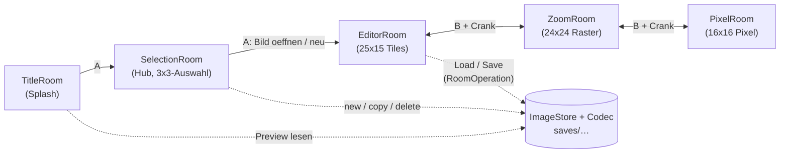
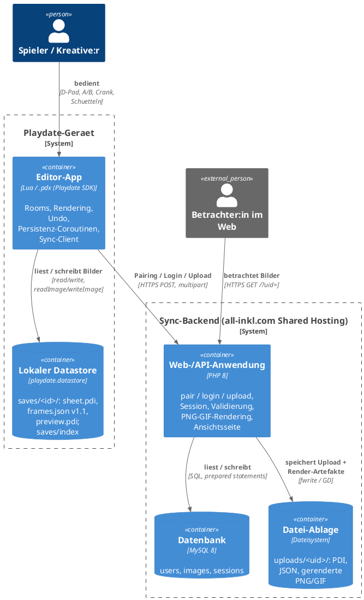
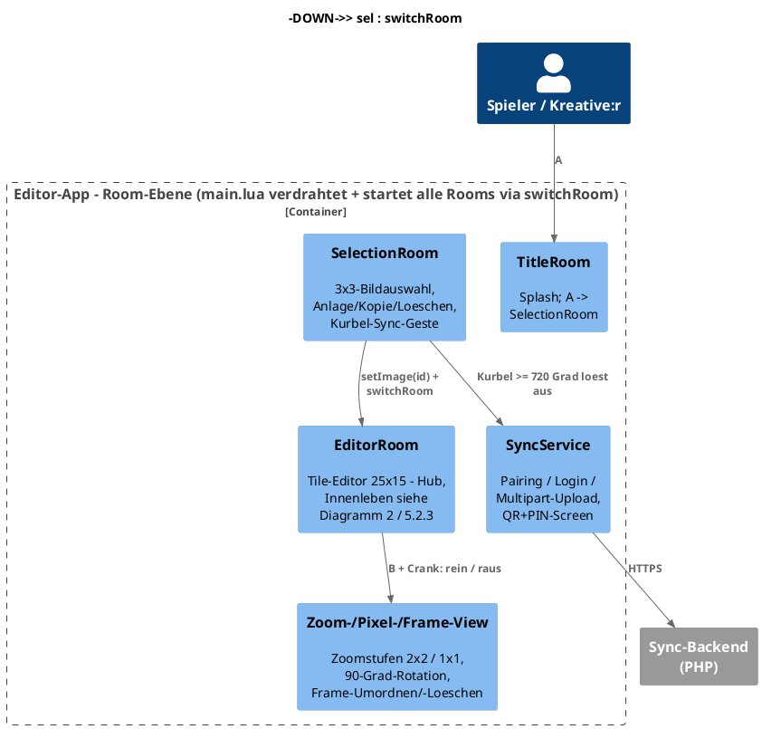
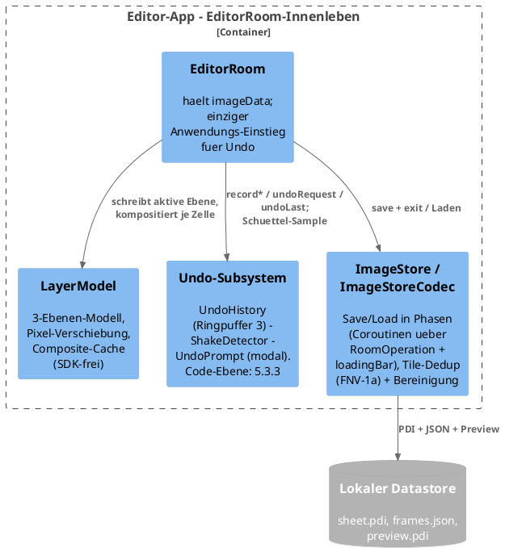
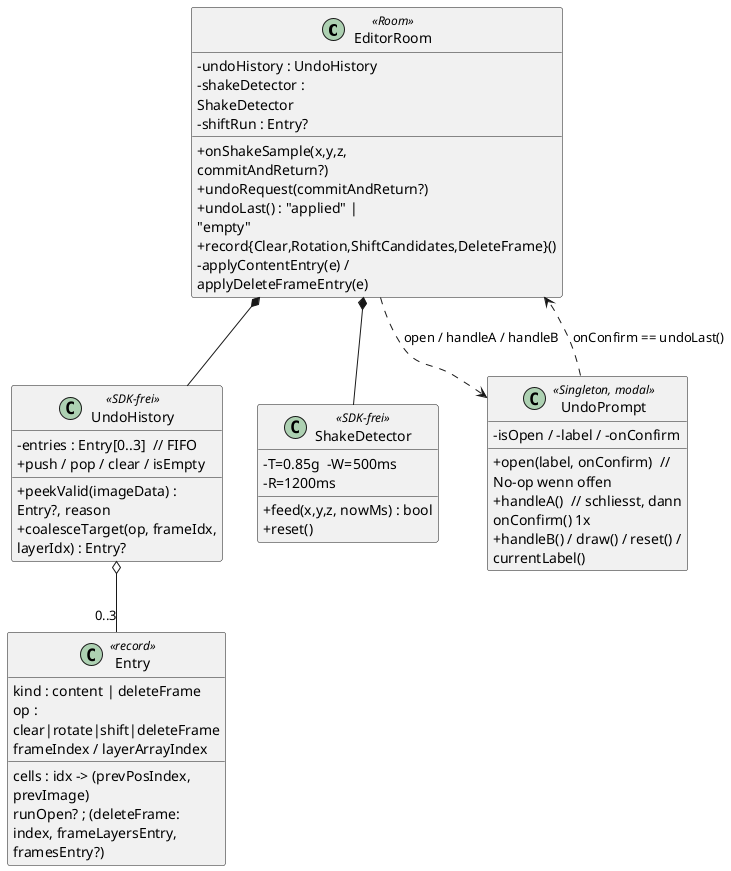
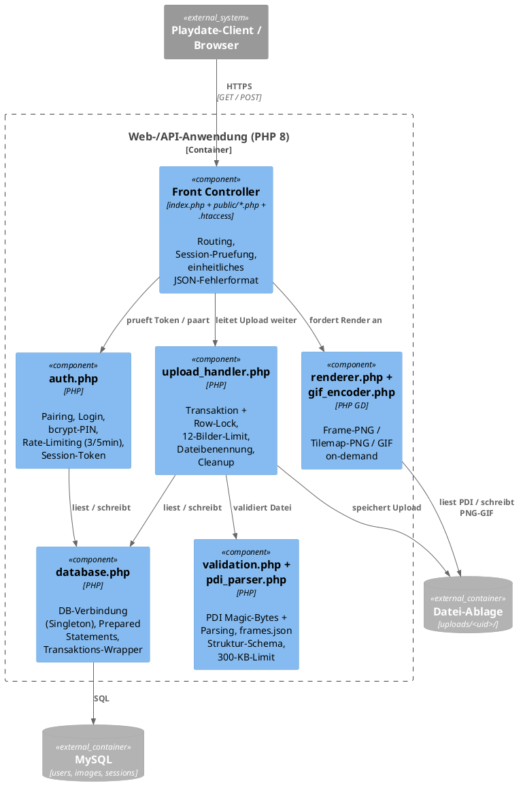

# 5. Bausteinsicht

## 5.1 Whitebox Gesamtsystem

Das Gesamtsystem besteht aus einer Room-Orchestrierung mit drei Editierstufen und einem nativen Persistenzpfad: TitleRoom -> SelectionRoom -> EditorRoom <-> ZoomRoom <-> PixelRoom; Speichern und Laden laufen ueber ImageStore/ImageStoreCodec (PDI-Tilemap + Positions-JSON, AD-017).



Die Navigation ist bewusst gerichtet: Der TitleRoom ist eine Einbahnstrasse (nur Splash), der SelectionRoom ist die Basis-Ebene — B fuehrt dort nicht zurueck. Zurueck aus dem Editor geht es ausschliesslich ueber "save + exit" (Systemmenue); innerhalb der Zoomkette navigiert B+Crank in beide Richtungen.

### 5.1.1 C4 Ebene 2 — Container



| Container | Technik | Verantwortung | Deployment |
|---|---|---|---|
| Editor-App | Lua, Playdate SDK CoreLibs; Paketierung als `.pdx` (`pdc`) | Der gesamte Editier-, Animations-, Undo- und Persistenz-Flow; kontaktiert das Backend nur bei der Sync-Geste | Playdate-Geraet / Simulator |
| Lokaler Datastore | `playdate.datastore` (`write`/`read`, `writeImage`/`readImage`) über das Playdate-Dateisystem | Persistente Bilder + Index; einzige Datenquelle des Editors zur Laufzeit | Geraet-lokal, im Datastore der App |
| Web-/API-Anwendung | PHP 8, kein Framework; `index.php` + `includes/*.php` + `public/*.php` | Pairing/Login/Session, Upload-Validierung + Transaktion, On-demand-Rendering, Ansichtsseite je UID | `backend/` → all-inkl.com via `backend/deploy.sh` (SFTP) |
| Datenbank | MySQL 8; Schema in `backend/sql/migrations/` bzw. `backend/storage/hansdither_schema.sql` | Metadaten: UID↔PIN-Hash, Bild-Datensätze, Sessions | all-inkl.com MySQL |
| Datei-Ablage | Dateisystem des Hosting-Accounts, `uploads/<uid>/` (`.htaccess`-geschützt) | Hochgeladene PDI/JSON + gerenderte PNG/GIF-Artefakte | all-inkl.com Webspace |

Der Editier-Kern (Editor-App + Datastore) ist vollstaendig offline
lauffaehig; nur die explizite Kurbel-Sync-Geste im SelectionRoom kontaktiert
die Web-/API-Anwendung.

### Enthaltene Bausteine

| Baustein | Verantwortung |
|---|---|
| main.lua | Initialisierung, Room-Verdrahtung (seit Spec 010 zusaetzlich EditorRoom ⇄ FrameManagementView), zentrales playdate.update, Terminate-Hook (Commit-Kette der Zoomstufen + Save des offenen Bildes); seit Spec 006 zusaetzlich gameWillPause-Hook (setzt/entfernt das System-Pause-Menuebild ueber EditorRoom:buildPauseMenuImage()). |
| TitleRoom | Einstieg/Startbildschirm; fuehrt zum SelectionRoom. |
| SelectionRoom | Bild-Auswahlscreen (3x3-Raster mit maskierten Thumbnails, endloses Scrollen); Anlage/Kopie/Loeschen ueber Systemmenue; setzt EditorRoom:setImage(id) und wechselt direkt in den Editor (AD-018). Seit Spec 006: der aktuell selektierte Eintrag zeigt zusaetzlich einen vollflaechigen, animierten Hintergrund (Lazy-Load der vollen Bilddaten, verwirft Ladevorgaenge bei schnellem Selektionswechsel) mit Muster-Stoereffekt; alle anderen Eintraege bleiben unveraendert statische Kreis-Thumbnails. |
| EditorRoom | Haupteditor: 25x15-Raster aus 16x16-Tiles auf nativen 400x240 via SDK-tilemap (AD-016). Cursor (D-Pad, SDK-keyRepeatTimer), A = Zeichnen/Toggle, B kurz = Pipette (zeigt kurz "Tile N picked"), B+Crank = Zoomtrigger / Frame-Verwaltung, Systemmenue (save + exit, clear screen [ersetzt seit Spec 008 "reset frame", AD-037; davor "delete frame", AD-032], show grid), Dedup-Commit-Pfad applyTileEdits. Seit Spec 006 zusaetzlich: Inaktivitaets-gesteuerte, cursor-abgewandte Frame-Positions-Bauchbinde und buildPauseMenuImage(). **Seit Spec 010**: haelt `imageData.frameLayers` (3 Ebenen je Frame, AD-039) als Wahrheit und `imageData.frames` als abgeleiteten flachen Composite-Cache (AD-041); alle Editier-Pfade schreiben nur die aktive Ebene (`writeActiveLayerPosition`, Radierer auf Ebene 2/3 → "absent"); `shiftActiveLayer(direction, cellIdx)` ist der US1-Einstieg — verschiebt seit **AD-043** nur die Zelle unter dem Cursor + deren einen Nachbarn (2-Tile-Streifen, `LayerModel.shiftTileContent`), synchron je Tastendruck, `recompositeCell` fuer die 1-2 geaenderten Zellen. **Steuerungs-Redesign (AD-042, 4. Runde):** B + Hoch/Runter zyklt die aktive Ebene (Indikator in der Bauchbinde), B + Links/Rechts wechselt den Frame (max. 12; Rechts am Ende = neuer Frame), die freie Kurbel oeffnet einen Tile-Picker ueber die referenzierten Kacheln (`referencedTileIndices()`), B + Crank rueckwaerts oeffnet die FrameManagementView. `bNavConsumed` trennt die B+D-Pad-Navigation von der Pipette. **Seit Spec 011 (AD-044..046):** besitzt die eine `UndoHistory`- und `ShakeDetector`-Instanz; `recordClear`/`recordRotation`/`recordShiftCandidates`/`recordDeleteFrame` erfassen die Pre-Zustaende, `onShakeSample` fuettert den Detektor (Sample aus `update()`), `undoRequest` oeffnet den `UndoPrompt` (commit-first bei Aufruf aus Zoom/Pixel), `undoLast` wendet ueber `applyContentEntry`/`applyDeleteFrameEntry` an. `clearUndoHistory()` (Verlauf + Detektor + `shiftRun`) bei jedem Load-/Save-/SelectionRoom-Wechsel. Accelerometer-Start in `entered()`, Stopp beim Ruecksprung zur Auswahl. |
| ZoomRoom | Mittlere Zoomstufe: 3x3-Tile-Kontext als 24x24-Malraster; Commit geaenderter Slots an EditorRoom:applyTileEdits; "All Similar" in-place. Seit Spec 006: echte Subpixel-Quadranten. Seit Spec 008: Hintergrund-Cache (AD-035). **Seit Spec 010**: B + Pfeiltaste verschiebt (AD-043) den Inhalt der Zelle unter dem Zoom-Cursor um 1 Pixel — ermittelt `slots[<Cursor-Slot>].frameIndexPos`, reicht Richtung + Zelle an `EditorRoom:shiftActiveLayer` durch, holt danach den 3x3-Kontext frisch, laesst aber den Zoom-Cursor stehen (wiederholtes B + Pfeil schiebt dieselbe Zelle weiter). Reicht `activeLayerIsBase` an den PixelRoom durch (ebenenabhaengiger "Nicht-Tinte"-Zustand, AD-040). **Seit Spec 011 (AD-044..046):** liest den Accelerometer je `update()` und reicht das Sample mit einem `commitAndReturnToEditor`-Callback an `EditorRoom:onShakeSample`; `setNewTile` gibt einen etwaigen Rotation-Snapshot des PixelRoom via `EditorRoom:recordRotation` in den Verlauf; `endShiftRun()` beim Betreten/Verlassen und bei `BButtonUp`; `UndoPrompt.draw()` + Input-/Crank-Gate bei offenem Dialog. |
| PixelRoom | Innerste Zoomstufe: ein Tile mit echten 16x16 Pixeln; Menueaktionen All Similar und Invert. Seit Spec 008: Kurbel-Rotation (AD-036). **Seit Spec 010**: 3-Zustands-Malraster (Tinte / weiss / transparent, `PixelTransparency`); gemalt wird **nur mit A** — A toggelt Tinte ↔ ebenenabhaengiger "Nicht-Tinte"-Zustand (weiss auf Ebene 1, `kColorClear` auf Ebenen 2–3), auf einer oberen Ebene radiert A auf Tinte also direkt nach transparent. **B malt nicht** (5. Runde, aus dem Hardware-Test — `BButtonDown/Up` sind No-ops); B bleibt allein der Zoom-Out-Modifier (B halten + Crank zurueck). `setCurrentTile(tile, idx, offStateCode)` (AD-040). **Seit Spec 011 (AD-044..046):** dritter `init`-Parameter `editorRoom`; `snapshotBeforeRotation()` sichert den `gridState` beim **ersten** `rotateGrid*()` je `setCurrentTile`-Sitzung, `consumeRotationSnapshot()` gibt ihn beim Commit an die ZoomRoom; liest den Accelerometer je `update()` (`commitAndReturnToEditor` = Exit-Kette `commitToZoomRoom` → `commitForTerminate` → `switchRoom`); `UndoPrompt.draw()` + Input-/Crank-Gate. |
| FrameManagementView | **Neu (Spec 010, US4).** Aus dem EditorRoom per Halten B + Kurbel rueckwaerts. Listet alle Frames; D-Pad = Cursor, A = markieren, A erneut = markierten Frame loeschen (min. 1), Links/Rechts = markierten Frame verschieben (frameLayers + Composite-Cache im Gleichschritt), B loslassen = zurueck (setzt `imageData.returnFrame`). Keine Ebenen-Verwaltung (AD-041). **Seit Spec 011:** `deleteMarked()` meldet den geloeschten Frame (tiefe Kopie + Cache-Kopie) **vor** `table.remove` an `EditorRoom:recordDeleteFrame`. Die Schuettel-Geste ist hier **nicht** aktiv (B durch die Halte-Geste belegt, AD-044/R6) — der Undo-Dialog erscheint erst nach Rueckkehr in den Tile View. |
| LayerModel | **Neu (Spec 010).** Reine-Tabellen-Datenmodell fuer die feste 3-Ebenen-Struktur je Frame: `newFrameLayersFromFlat`/`padTo3`/`validate`, `compositeToFlat` (flacher Cache), `compositeToTiles` (pixel-genau, noch nicht verdrahtet), `cycleActive`/`clampActive`, `shiftDelta` + `shiftTileContent` (Pixel-Shift einer Zelle, AD-043). Kein Add/Delete von Ebenen (AD-039). **AD-043 (aus dem Hardware-Test)**: `shiftTileContent(entry, active1, cellIdx, dir, getTile, registerTile)` verschiebt Zelle `cellIdx` + den einen Nachbarn in Schieberichtung als 2-Tile-Streifen um 1px (abgewandte Nachbar-Kante faellt weg, KEIN Wrap; am Rasterrand nur die Zelle). Ersetzt die entfernte Ganz-Ebenen-Verschiebung `shiftLayerContent` (+ `decodeLayerGrid`/`materializeShiftedGrid`/`imageFromGrid`). |
| PixelTransparency | **Neu (Spec 010).** 3-Zustands-Pixelmodell (OPAQUE/TRANSPARENT/EMPTY) + Bruecke zu `gfx.kColor*` (`fromColor`/`toColor`/`sampleState`). Genutzt von PixelRoom, LayerModel, ImageStoreCodec (AD-040). |
| UndoHistory | **Neu (Spec 011).** Reine-Tabellen-Ringpuffer (`MAX = 3`, FIFO) fuer die Pre-Zustands-Snapshots der vier riskanten Operationen: `new`/`push`/`peekValid(imageData) -> entry, reason`/`coalesceTarget(op, frameIndex, layerArrayIndex)`/`pop`/`clear`/`isEmpty`. `peekValid` siebt nicht-anwendbare Eintraege **vor** dem Dialog aus (fehlender Ziel-Frame → verwerfen; `deleteFrame` bei 12 Frames → `reason = "frame-limit"`). SDK-frei (AD-045). |
| ShakeDetector | **Neu (Spec 011).** SDK-freier X-Achsen-Zustandsautomat: `new(opts?)` → `feed(x, y, z, nowMs) -> bool` / `reset()`. Peak `> +T` und Peak `< −T` innerhalb `W` ms → Kante, danach `R` ms Refraktaersperre. Startwerte `T = 0.85 g`, `W = 500 ms`, `R = 1200 ms` (Hardware-Tuning offen, Spec Open #4). `nowMs` wird hereingereicht → headless mit Mock-Uhr testbar (AD-044). |
| UndoPrompt | **Neu (Spec 011).** Singleton-Ja/Nein-Dialog nach dem `SelectionRoom.confirmingDelete`-Muster: `open(label, onConfirm)` (No-op wenn offen, FR-015), `isOpen`/`currentLabel`, `handleA` (erst schliessen, dann `onConfirm` einmal), `handleB`, `draw` (zentrierte Box), `reset`. Von EditorRoom/ZoomRoom/PixelRoom am Ende von `draw()` gezeichnet; jeder Input-Callback + Crank-Block dieser Raeume gated auf `isOpen()` (FR-013, AD-046). |
| ImageStore | Bildverwaltung: Index (saves/index), Anlage/Kopie/Loeschen, Preview-Zugriff. Seit Spec 010: `createImage` legt `frameLayers` (3 Ebenen) an. |
| ImageStoreCodec | Coroutine-basierte Save-/Load-Operationen: PDI-Sheet (deduplizierte Tiles) + frames.json, FNV-1a-hashTile, Slicing inkl. hashIndex. Seit Spec 009: `pruneUnusedTiles()` (AD-005). **Seit Spec 010**: frames.json Version `"1.1"` mit verschachtelten Ebenen (`createFramesTableV11`; leere obere Ebenen weggelassen); `newLoadOperation` erkennt v1.0/v1.1 strukturbasiert und fuellt jeden Frame auf 3 Ebenen auf; `hashTile`/`imagesVisiblyEqual` unterscheiden 3 Pixelklassen (schwarz/weiss/transparent, AD-040); `pruneUnusedTilesLayered` bereinigt ueber alle Ebenen aller Frames. |
| loadingBar | Einheitliches Overlay fuer Lade-/Speicherfortschritt (Titel, Phasen-Detail, Fehlerstatus). |
| RoomOperation | Gemeinsame Coroutine-Orchestrierung fuer room-lokale Langlaeufer; reicht Phasen-Yields ans Overlay und das Coroutine-Ergebnis an onComplete durch. |
| Bauchbinde | Wiederverwendbare UI-Komponente fuer Hinweisbaender (Frame-Anzeige "Frame n/m", Fehlerstatus). |
| PencilCursor | Cursor-Overlay fuer alle Editierstufen. |
| tests/headless_tests.lua | SDK-freie Regressionstests (normaler Lua-Interpreter, strikte Playdate-Mocks); fangen insbesondere die Fehlerklasse "nicht existierende SDK-API" vor dem Simulator-Lauf ab. |
| Tools/Importer (index.html, app.js) | Historisches Browser-Tool fuer PNG-Import in Pulp-JSON; mit dem v0.3.0-Format nicht kompatibel (bewusst, R-14). |

### Entfallene Bausteine (v0.2 -> v0.3.0)

| Entfallen | Ersatz |
|---|---|
| TileRoom, TileRoomEditor, TileRoomPersistence | EditorRoom (Neuaufbau ohne Pulp-Kopplung, Offscreen-Buffer, Tile-Picker und EditMode-Automat) |
| LoadRoom, LoadRoomGrid | SelectionRoom (AD-018) |
| PulpGameIO, PulpGameIOShared, PulpGameIOSave, PulpGameIOLoad | ImageStore/ImageStoreCodec (AD-017) |
| GameRoom | Durch SelectionRoom ersetzt (AD-018); Datei entfernt. |

### Wichtige Schnittstellen

- switchRoom(newRoom): room-uebergreifende Navigation inklusive Input-Handler-Wechsel.
- EditorRoom:setImage(id) / entered(): Kontextsetzung durch SelectionRoom; das Laden laeuft asynchron als RoomOperation beim Room-Eintritt.
- EditorRoom:applyTileEdits(edits): Ruecknahme geaenderter Zoom-Slots ueber den Dedup-Pfad (hashIndex + Pixelvergleich); schreibt nur den aktiven Frame.
- EditorRoom:getImageData(): Zugriff fuer den Terminate-Hook in main.lua.
- EditorRoom:buildPauseMenuImage(): liefert das 400x240-Menuebild fuer playdate.setMenuImage() (Spec 006); nil ohne geladenes imageData. Ausschliesslich aus main.lua:gameWillPause() aufgerufen.
- ZoomRoom:setFromEditorContext(ctx): Uebernahme des 3x3-Kontexts (Slots, 24x24-gridState, showGrid, imageData-Referenz).
- ZoomRoom:setNewTile(tile) / updateExistingTile(tile, idx): Rueckgabe aus PixelRoom (Standard- bzw. All-Similar-Pfad).
- ZoomRoom:commitForTerminate() / PixelRoom:commitForTerminate(): Commit ohne Room-Wechsel fuer den Terminate-Hook.
- ImageStoreCodec.newSaveOperation(imageData) / newLoadOperation(id): Coroutine-Fabriken fuer RoomOperation.
- RoomOperation:start()/resume(onError): generischer Ablauf fuer Coroutine + loadingBar-Lifecycle inkl. Fehlerpfad.

## 5.2 Ebene 2

### C4 Ebene 3 — Komponenten der Editor-App

Wegen des Hub-Charakters von `EditorRoom` in zwei Sichten aufgeteilt:
(1) die Room-Ebene, (2) das EditorRoom-Innenleben.

**Diagramm 1 — Room-Ebene**



**Diagramm 2 — EditorRoom-Innenleben**



Verdichtete Boxen (Whiteboxen 5.2.1–5.2.7):

| Box im Diagramm | Reale Module | Detail |
|---|---|---|
| Zoom-/Pixel-/Frame-View | `ZoomRoom`, `PixelRoom`, `FrameManagementView` | 5.2.4 / 5.2.5 / 5.2.x; `PixelTransparency` (3-Zustands-Pixelmodell) ist Hilfsmodul von PixelRoom + LayerModel |
| Undo-Subsystem | `UndoHistory`, `ShakeDetector`, `UndoPrompt` | SDK-frei bis auf `UndoPrompt.draw()` (CoreLibs/graphics). Instanzen leben in `EditorRoom`; Ablauf siehe 5.3.3 + Kap. 6.16 |
| ImageStore / ImageStoreCodec | `ImageStore` (Index, CRUD, Preview), `ImageStoreCodec` (Save/Load-Coroutinen) | 5.2.6; getrieben von `RoomOperation` + `loadingBar` |
| — nicht im Diagramm | `Bauchbinde`, `PencilCursor`, `loadingBar`, `RoomOperation` | UI-/Ablauf-Helfer ohne eigene fachliche Verantwortung (Enthaltene-Bausteine-Tabelle in 5.1) |

### 5.2.1 Whitebox main.lua

Verantwortung:
- Imports aller Rooms und CoreLibs
- Verkabelung: TitleRoom -> SelectionRoom -> EditorRoom <-> ZoomRoom <-> PixelRoom
- Lebenszyklusverwaltung und Terminate-Hook

Interne Logik:
- currentRoom als Single-Point-of-Truth fuer Update und Input.
- Display-Scale ist auf 1 gesetzt; alle Rooms arbeiten nativ auf 400x240.
- Beim Raumwechsel werden Input-Handler ausgetauscht, danach entered() aufgerufen.
- gameWillTerminate(): aktive Zoomstufen committen zuerst (PixelRoom -> ZoomRoom -> EditorRoom), dann wird das offene Bild synchron ueber ImageStoreCodec gespeichert.
- gameWillPause() (Spec 006, AD-031): ruft EditorRoom:buildPauseMenuImage() + playdate.setMenuImage() auf, wenn currentRoom EditorRoom/ZoomRoom/PixelRoom ist (alle drei referenzieren dasselbe imageData), sonst setMenuImage(nil) — laeuft nur beim tatsaechlichen Pausieren, nicht pro Frame.

### 5.2.2 Whitebox SelectionRoom

Verantwortung:
- Auswahl, Anlage (mit Keyboard-Namenseingabe), Kopie und Loeschen von Bildern.
- Vorschaubilder aus dem ImageStore laden und als maskierte Kreis-Thumbnails darstellen.
- Uebergang in den Editor via setImage(id) + switchRoom.

Interne Logik:
- Basis-Ebene der Navigation: B fuehrt nicht zum TitleRoom zurueck; B schliesst nur Loesch-Dialog bzw. Keyboard.
- Selektion laeuft ausschliesslich ueber setSelectedIndex() und ist damit immer mit der Gridview-Selektion (setSelection/scrollToCell) synchron; Navigation klemmt an vorhandenen Eintraegen.
- Namenseingabe ueber das SDK-Keyboard: Commit/Abbruch via keyboardWillHideCallback(ok); waehrend das Keyboard sichtbar ist, wird jeder Frame neu gezeichnet (Raster + Eingabezeile unten links).
- Thumbnail-Cache mit Negativ-Eintraegen (false = "Preview fehlt"), damit fehlende Previews nicht pro Frame von der Platte gelesen werden.
- Spec 006 (Titelscreen-Animation): setSelectedIndex() startet bei jedem Wechsel einen Lazy-Load der vollen Bilddaten (ImageStoreCodec.newLoadOperation + RoomOperation, stiller Overlay ohne sichtbare loadingBar) fuer den neu selektierten Eintrag; ein Ladevorgang fuer einen bereits verlassenen Eintrag wird durch reines Ueberschreiben der Referenz nicht mehr resumed (kein Cancel-Callback noetig, reiner Lesevorgang). Nach Abschluss zeichnet update() ein Tilemap-basiertes 400x240-Vollbild plus einen zeitlich wechselnden Muster-Overlay (gfx.setPattern-Phasenwechsel) VOR dem Gridview; drawCell() laesst die Zelle des betroffenen Eintrags frei, alle anderen Zellen bleiben unveraendert.

### 5.2.3 Whitebox EditorRoom

Verantwortung:
- Haupt-Arbeitsflaeche: 25x15-Tilemap auf voller Displayflaeche, Cursor, Grid-Overlay.
- Eingabesemantik: A zeichnet/toggelt, kurzer B-Tipp pipettiert, **B+Crank zoomt / oeffnet die Frame-Verwaltung** (AD-019, unveraendert). Seit AD-042 (Spec 010, 4. Runde): **B + Hoch/Runter = aktive Ebene**, **B + Links/Rechts = Frame**, **freie Kurbel = Tile-Picker** — Ebenen-/Frame-Wechsel liegen nicht mehr auf der Kurbel.
- Frame-Verwaltung mit Kopie-Semantik, harter 12er-Grenze und beidseitiger Rotation; B + Rechts am letzten Frame haengt einen neuen Frame an (einzige Anlage-Geste); Umordnen/Loeschen in der FrameManagementView (5.2.x), "delete frame" via Systemmenue entfiel mit AD-037.
- Autosave: "save + exit" startet die Save-Operation und wechselt nach Erfolg zum SelectionRoom; Fehler zeigen einen Status, der Editor bleibt bedienbar.

Besonders relevante interne Teile:
- tilemap:setTiles(frames[currentFrame], 25) als einziger Frame-Wechsel-Pfad (keine Bildkopien im Update-Pfad).
- appendTileImage() laesst die Imagetable beim Malen wachsen (mit Neuaufbau-Fallback) und haelt den hashIndex konsistent.
- Eingaben sind waehrend laufender Save-/Load-Operationen blockiert (inkl. Menueaktionen).
- Crank-Lese-API (Spec 006 CR-01, **praezisiert AD-047**): pro update() **steuert** GENAU EINE die Logik — `getCrankTicks(4)` im B-Zweig (Zoomkette / Frame-Verwaltung), `getCrankChange()` im Ohne-B-Zweig — **beide werden aber jeden Frame einmal gelesen** (`handleCrank` liest sie vorab in lokale Variablen; bei offenem Undo-Dialog und in den Load-/Save-Zweigen von `update()` nur zum Drain), der nicht genutzte Wert wird verworfen. Sonst entlaedt der zustandsbehaftete Tick-Zaehler nach einer laengeren Picker-Drehung den kompletten Rueckstand beim ersten B-Frame als Phantom-Zoom (Review F2). **Seit AD-042** treibt der Ohne-B-Zweig den Tile-Picker: `crankAccumDegrees` akkumuliert die Netto-Grad, je `PICKER_DEGREES_PER_TILE` (30°) eine Kachel weiter durch `referencedTileIndices()` (Wrap am Ende); das Overlay blendet ~1,5 s nach der letzten Drehung aus (Timeout-Uebergang in update(), analog Bauchbinde). Frame-/Ebenen-Wechsel per Kurbel-Volldrehung entfiel.
- Spec 010 (AD-042): B + D-Pad ruft `bDpadNav()` — Hoch/Runter → `cycleActiveLayer(±1)`, Links/Rechts → `tickForward`/`tickBackward`. Der Key-Repeat-Callback von `startMove` friert den Cursor ein, sobald B gedrueckt ist. `bNavConsumed` (in `bDpadNav` gesetzt, nur in `BButtonDown`/`BButtonUp` zurueckgesetzt) unterdrueckt die Pipette beim folgenden B-Release. Die Pipette meldet ueber `setPickMessage()` kurz "Tile N picked" (ersetzt fuer ~1,5 s das Frame/Ebenen-Label im selben Bauchbinden-Balken).
- Spec 010 US1 (AD-043, aus dem Hardware-Test): `shiftActiveLayer(direction, cellIdx)` (Einstieg von der ZoomRoom, B + Pfeiltaste) verschiebt nur die Zelle `cellIdx` + deren einen Nachbarn in Schieberichtung als 2-Tile-Streifen um 1px (`LayerModel.shiftTileContent`), synchron, `recompositeCell` fuer die 1-2 geaenderten Zellen. Ohne `cellIdx` die Zelle unter dem Editor-Cursor. Ganz-Ebenen-Verschiebung + aufgeschobene Materialisierung (frueherer AD-043-Entwurf) entfallen.
- Spec 006 (Bauchbinde): lastActivityMs wird bei jeder Eingabe (D-Pad, A, B, beide Crank-Pfade) aktualisiert; draw() zeigt die Frame-Positions-Bauchbinde nur, wenn seit der letzten Eingabe < 5s vergangen sind, auf der dem Cursor gegenueberliegenden Bildschirmhaelfte. Ein Sichtbarkeits-Uebergang wird in update() per Zeitvergleich erkannt und loest gezielt genau einen Redraw aus (analog zum bestehenden statusMessage-Timeout-Muster) — sonst wuerde die Bauchbinde bei reiner Inaktivitaet nie tatsaechlich verschwinden, da draw() nur bei needsRedraw==true laeuft.
- Spec 008 (Clear Screen, AD-037, ersetzt Spec 006/AD-032): clearCurrentFrame() setzt alle 375 Tile-Indizes des aktiven Frames auf den Basis-Index 1 (Voll-Weiss). Ausgeloest ueber den Systemmenuepunkt "clear screen", der "reset frame" vollstaendig ersetzt; resetCurrentFrameToPrevious() ist im Unterschied zu deleteCurrentFrame() (AD-032) NICHT als toter Code erhalten, sondern vollstaendig aus dem Code entfernt (FR-011).
- Spec 006 (Pause-Ansicht): buildPauseMenuImage() zaehlt unterschiedliche Tile-Indizes ueber `referencedTileIndices()` (NICHT imagetable:getLength(), das koennte nicht mehr referenzierte Alt-Eintraege mitzaehlen), zeichnet bis zu 120 Vorschauen im 12x10-Raster (bei mehr: Truncation, Gesamtzahl bleibt korrekt) sowie Gesamtzahl/Frame-Anzahl, ausschliesslich im linken 200px-Bereich (rechte Haelfte vom System-Menue ueberdeckt). Seit Spec 010 ist `referencedTileIndices()` derselbe faktische Scan wie fuer den Tile-Picker (Ebenen-Positionen statt Composite-Cache — verdeckte Kacheln zaehlen jetzt mit). Der Picker cacht + ergaenzt den Abwahl-Slot (Index 1) ueber `pickerList()`; die Pause-Ansicht nutzt den un-erweiterten Scan direkt, damit „Tiles: N“ faktisch bleibt.

### 5.2.4 Whitebox ZoomRoom

Verantwortung:
- 3x3-Tile-Kontext als 24x24-Malraster darstellen (Zelle = 2x2 native Pixel, Anzeige 10 px/Zelle, 240x240 zentriert).
- Slot-Mapping inkl. out-of-bounds-Behandlung (Randslots nicht editierbar).
- Aenderungen nur bei Differenz als Edit-Liste an EditorRoom:applyTileEdits zurueckgeben.
- showGrid-Status aus dem EditorRoom uebernehmen (gestrichelte Zellgrenzen).

Interne Logik:
- gridState (24x24, boolesch) plus baselineGrid als Dekodier-Snapshot; Nutzeraenderungen = Abweichungen von der Baseline.
- buildWorkingImage() brennt nur geaenderte Zellen als 2x2-Bloecke ins Basisbild und erhaelt damit feinere Pixel-Details aus dem PixelRoom. **Review F6:** der "aus"-Wert einer Zelle ist ebenenabhaengig — `offColor = activeLayerIsBase and kColorWhite or kColorClear`. Auf einer oberen Ebene (2/3) radiert das Raster also nach **transparent**, nicht nach opakem Weiss; sonst stanzte das Radieren ein weisses Loch, das die darunterliegenden Ebenen beim Compositing/Save verdeckt (nur ein KOMPLETT weisses Tile mappt `writeActiveLayerPosition` wieder auf ABSENT). Konsistent mit dem PixelRoom. Grenze: `gridState` bleibt 2-wertig (schwarz / nicht-schwarz) — "weiss vs. transparent" der Quelle wird nicht getrennt gefuehrt, nur der Radier-Zielzustand ist korrekt.
- "All Similar" aus dem PixelRoom schreibt das Tile in-place in die Imagetable (wirkt auf alle Verwendungen ueber alle Frames, FR-013-Ausnahme) und fuehrt den hashIndex nach. **Review F8:** danach `editorRoom:onTileImageReplaced(tileIndex)` → `recompositeCurrentFrame()`, damit Zellen mit zusammengefuehrtem Composite (mehrere sichtbare Ebenen) nicht die alten Pixel des ersetzten Index weiterzeigen (einmalig beim Commit, nicht pro Tastendruck).
- Spec 006 (Subpixel-Rendering): drawGrid() zeichnet fuer Zellen mit gridState[r][c] == baselineGrid[r][c] (unbearbeitet) die vier echten Quellpixel des zugehoerigen 2x2-Blocks einzeln als 5x5-Quadranten statt einer einfarbigen 10x10-Flaeche; bearbeitete Zellen bleiben unveraendert flaechig (Editier-Semantik selbst unangetastet).
- Spec 008 (Redraw-Cache, AD-035): drawGrid() baute bislang bei JEDER Interaktion alle 576 Zellen (inkl. Subpixel-Sampling) und alle Gitterlinien neu auf — Hauptursache des gemeldeten Ruckelns. Neu: cachedBackground (ein per gfx.pushContext/gfx.popContext einmalig aufgebautes 400x240-Vollbild inkl. Checkerboard-Seitenflaechen, unbearbeiteten Zellen und Gitterlinien — korrigiert waehrend der Implementierung von der urspruenglich geplanten 240x240-Variante, ein einziger draw(0,0)-Aufruf genuegt so) wird nur bei setFromEditorContext()/setNewTile()/updateExistingTile() neu aufgebaut (backgroundDirty; showGridLines aendert sich ausschliesslich innerhalb von setFromEditorContext(), kein separater Live-Toggle in einer laufenden Sitzung); jeder Redraw blittet cachedBackground und uebermalt nur die in changedCells gesammelten tatsaechlich geaenderten Zellen ueber die neue Hilfsfunktion drawCell(r,c). Editier-/Commit-Logik selbst unangetastet.
- Spec 010 US1 (AD-043): `shiftActiveLayerContent(direction)` committet offene Zell-Edits, ermittelt die Zelle unter dem Zoom-Cursor (`slots[getSlotForCell(cursorRow,cursorCol)].frameIndexPos`) und ruft `editorRoom:shiftActiveLayer(direction, <Zelle>)`. **Review F10 (Perf):** ein Shift AUF der aktiven Ebene aendert das Quellbild von hoechstens 2 Zellen (Zielzelle + 1 Nachbar in Schieberichtung) → nur die zugehoerigen 1-2 Slots per `editorRoom:zoomSlotImageAt(frameIndexPos)` + `decodeImageIntoGrids` auffrischen und ihre 64 Zellen als `changedCells` markieren; **kein** `currentZoomContext()`-Vollaufbau (9× `compositeBelow`) und **kein** `backgroundDirty` (576-Zellen-Cache bleibt gueltig, wird nur uebermalt) mehr pro Tastendruck. `compositeBelow` (Ebenen UNTER der aktiven) ist von einem Shift auf der aktiven Ebene nicht betroffen. Der Zoom-Cursor bleibt stehen (wiederholtes B + Pfeil schiebt dieselbe Zelle). Aeltere/gemockte EditorRoom ohne `zoomSlotImageAt` fallen auf den `currentZoomContext()`-Vollaufbau zurueck.
- **Review F7** (`EditorRoom.applyDeleteFrameEntry`, hier referenziert): fehlt beim `deleteFrame`-Undo der gepufferte flache Cache-Eintrag (`framesEntry == nil`, defensiver `recordDeleteFrame`-Pfad), wird er aus der wieder eingefuegten Ebenen-Struktur via `LayerModel.compositeToTiles` rekonstruiert — sonst liefen `imageData.frameLayers` und `imageData.frames` in der Laenge auseinander.
- **Review F11** (`EditorRoom.pipette`): greift den Tile-Index von der **aktiven Ebene** (`activeLayerObj().positions[cell]`) ab, nicht aus dem flachen Composite-Cache `imageData.frames` — dessen Eintrag kann fuer eine Mehr-Ebenen-Zelle ein zusammengefuehrtes Tile mit `kColorClear`-Pixeln sein, das auf die 2-wertige Basisebene gestempelt deren Tinte/Weiss-Modell verletzt. `0` (ABSENT auf einer oberen Ebene) → Abwahl + Meldung "Layer empty here".

### 5.2.5 Whitebox PixelRoom

Verantwortung:
- 16x16-Pixelbearbeitung eines ausgewaehlten Tiles (Anzeige 14 px/Zelle, 224x224 zentriert).
- Rueckgabe entweder als bearbeitetes Tile (Dedup beim Commit) oder in-place-Aenderung (All Similar).

Interne Logik:
- gridState als Pixelraster; seit Spec 010 3-Zustands-Codes (`PixelTransparency`: OPAQUE/TRANSPARENT/EMPTY) statt Bool. Menueaktionen All Similar (Checkmark) und Invert.
- Spec 010: gemalt wird **ausschliesslich mit A**. `beginStroke()` (ohne Tasten-Parameter) setzt den Strichwert aus der ersten Zelle — A auf Tinte → `offState` (ebenenabhaengig: EMPTY/weiss auf Ebene 1, TRANSPARENT/`kColorClear` auf Ebenen 2–3, gesetzt via `setCurrentTile(..., offStateCode)`), sonst OPAQUE. **B startet keinen Strich** (5. Runde, Hardware-Test): `BButtonDown/Up` sind No-ops — das beseitigt auch den "stray" transparenten Pixel, den die frühere B-Malaktion bei jeder B-Halten-Zoom-Out-Geste ins Tile schrieb. `moveCursor` malt einen laufenden Strich nur weiter, solange `kButtonA` gehalten ist.
- B+Crank rueckwaerts uebergibt an ZoomRoom; vorwaerts ist an der innersten Stufe ein No-op.
- Spec 008 (Pixel-Rotation, AD-036): Crank OHNE gehaltene B-Taste war bislang wirkungslos; jetzt akkumuliert getCrankChange() in rotationAccumDegrees (analog crankAccumDegrees, Spec 006). Bei ±360° netto wird gridState per exaktem 16x16-Index-Remap (new[r][c] = old[17-c][r] vorwaerts, new[r][c] = old[c][17-r] rueckwaerts) um 90 Grad rotiert — kein SDK-Bildtransform (rotatedImage/drawRotated), da diese laut SDK-Doku fuer Transformationen "quite slow" sind und Resampling-Artefakte einfuehren koennten. B+Crank-Zoomkette (getCrankTicks(4)) bleibt logisch exklusiv getrennt (pro update() **steuert** genau eine Crank-Lese-API, analog CR-01/PR-01) — beide APIs werden aber seit AD-047 jeden Frame einmal gelesen und der nicht genutzte Wert verworfen (Drain, sonst loest ein aus der Rotation aufgestauter Tick-Rueckstand beim ersten B-Frame faelschlich den Zoom-Out aus, Review F1).

### 5.2.6 Whitebox ImageStore / ImageStoreCodec

Verantwortung:
- ImageStore: Indexdatei, Bildverwaltung (create/copy/delete/list), Preview-Zugriff.
- ImageStoreCodec: phasenweises Speichern (Dedup, Sheet, Frames, Bilddaten, Preview, Index) und Laden (Frames lesen, Sheet lesen, Slicing, Validierung) als Coroutinen.

Interne Logik:
- Ablage je Bild unter saves/<id>/: sheet.pdi (deduplizierte, seit Spec 009 zusaetzlich um ungenutzte Tiles bereinigte 16x16-Tiles), frames.json (375 Indizes je Frame), preview.pdi.
- FNV-1a-hashTile als gemeinsame Dedup-Grundlage von Codec und Editor-Commit-Pfad.
- Spec 009: Die "Dedup"-Phase von newSaveOperation() ruft `pruneUnusedTiles(imagetable, frames, tileCount)` auf — eine reine Funktion, die ueber alle Frames hinweg ermittelt, welche Tiles noch referenziert werden, alle anderen (ausser den beiden Basistiles) entfernt und die verbleibenden Frame-Positionen auf die neu durchnummerierten Indizes remapped. Die Folgephasen (Sheet, Frames, Bilddaten, Preview) verarbeiten ab dann die bereinigten Werte. Kein Zugriff auf imageData — der Editor verlaesst nach "save + exit" ohnehin immer den Raum, ein Sync des Live-Editierzustands ist daher nicht noetig.
- Laden baut die Laufzeit-Imagetable samt hashIndex auf; Frame-Daten werden defensiv validiert (Fallback auf Weiss-Tile).

### 5.2.7 Whitebox Tools/Importer (historisch)

- Browser-Tool fuer den PNG-Import ins Pulp-JSON-Format (v0.2). Mit dem v0.3.0-Speicherformat nicht kompatibel; eine Anpassung ist ein spaeteres Vorhaben (R-14). Das Tool bleibt offline/exportbasiert und schreibt nie in bestehende Dateien.

## 5.3 Ebene 3 (fokussiert)

### 5.3.1 Zoom-Commit-Substruktur

- Input: 3x3-Slot-Kontext (frameIndexPos, originalIndex, originalImage) + gridState/baselineGrid + ggf. editierte Tiles aus PixelRoom.
- Verarbeitung: Aenderungserkennung (Zell-Diff bzw. editedImage) -> Arbeitsbild bauen -> Pixelvergleich gegen Original (Z-03) -> Edit-Liste.
- Output: EditorRoom:applyTileEdits dedupliziert (hashIndex + Pixelvergleich) oder haengt neue Tiles an und schreibt frames[currentFrame].

### 5.3.2 Persistenz-Substruktur im Codec

- Input: imageData (id, name, imagetable, frames, hashIndex)
- Verarbeitung: Sheet komponieren -> frames.json aufbauen -> Dateien schreiben -> Preview aus Frame 1 rendern -> Index aktualisieren (letzte Phase, C-06)
- Output: saves/<id>/{sheet.pdi, frames.json, preview.pdi} + aktualisierter Index

### 5.3.3 C4 Ebene 4 (Beispiel) — Undo-Subsystem

Die Code-Ebene wird nicht flaechendeckend gezeichnet; hier ein Beispiel fuer
das in sich geschlossene Undo-Subsystem (Spec 011, AD-044..046). Details zu
den Feldern/Regeln stehen in den ADRs und in Kap. 6.16.



Ablauf: `onShakeSample` → `ShakeDetector.feed` → (Kante) `undoRequest` →
ggf. `commitAndReturn()` → `UndoHistory.peekValid` → `UndoPrompt.open(label)`
→ (A) `undoLast` → `apply*Entry` → `UndoHistory.pop`. Ausfuehrlich in Kap. 6.16;
Feld-/Regel-Details in ADR-045/046.

---

## 5.4 Backend-Service (Hans Dither Sync)

### 5.4.1 Whitebox Backend-Service

**Verantwortung:**
- Bereitstellung einer Web-API für Synchronisation von Hans-Dither-Projekten zwischen Playdate-Geräten und Web-UI
- Authentifizierung via UID (Playdate-Geräte-ID) und 4-stelliger PIN
- Speicherung von PDI- und JSON-Dateien im Dateisystem
- On-demand PNG-Rendering aus PDI + Tilemap-JSON

**Bausteine:**

| Baustein | Verantwortung | Technologie |
|---|---|---|
| `public/index.php` | Einstiegspunkt: UID-Eingabe, Pairing, Login, Images-Liste | PHP 8.x |
| `public/upload.php` | Upload-Handler für PDI + JSON-Dateien | PHP 8.x |
| `public/download.php` | Download-Handler für JSON/PNG (Frame-Auswahl seit Spec 009)/Tilemap-PNG (neu, Spec 009)/GIF-Dateien; PDI-Route seit Spec 009 entfernt (liefert `410 Gone`, `deliverPdi()` gelöscht, kein toter Code, AD-038) | PHP 8.x |
| `includes/config.php` | Konfiguration: DB-Zugang, Pfade, Konstanten | PHP 8.x |
| `includes/database.php` | MySQL-Datenbankverbindung mit Prepared Statements; seit Spec 007 auch Transaktions-Wrapper (`beginTransaction()`/`commit()`/`rollback()`) für den race-sicheren Upload-Zähl-Check (ADR-033) | MySQLi |
| `includes/auth.php` | PIN-Authentifizierung, bcrypt-Hashing, Rate-Limiting, Session-Management | PHP 8.x |
| `includes/validation.php` | Dateivalidierung: PDI (Magic Bytes + vollständiges Parsing via `pdi_parser.php`), JSON (Syntax + seit Spec 007 Struktur-Schema via `validateFramesJsonSchema()`, ADR-034); Dateigrößen-Limit seit Spec 007 auf 300 KB gesenkt | PHP 8.x |
| `includes/upload_handler.php` | Datei-Speicherung, UUID-Generierung, DB-Einträge; seit Spec 007 zusätzlich pro-UID-Obergrenze von 12 Bildern via Transaktion + Row-Lock (ADR-033); seit Spec 009 Dateibenennung nach `client_image_id` (sanitisierter Projektname) statt der internen UUID, inkl. Aufräumen alter/veralteter Dateien bei Umbenennung bzw. Re-Sync (AD-038); zusätzlich `getFrameCount()` (Frame-Anzahl aus frames.json, kein neues DB-Feld) | PHP 8.x |
| `includes/renderer.php` | PNG-Rendering aus PDI + JSON via GD-Bibliothek; seit Spec 009 `renderFrameToPng()` (beliebiger 0-basierter Frame-Index statt nur Frame 0) und `renderTilemapToPng()` (Tile-Sammlung als PNG in Playdate-SDK-Namenskonvention `<name>-table-16-16`, AD-038) | PHP GD |
| `MySQL-Datenbank` | Speicherung von UID→PIN-Hash, Images-Metadaten, Sessions | MySQL 8.x |
| `Dateisystem` | Speicherung von PDI/JSON/PNG-Dateien unter `/uploads/{UID}/` | all-inkl.com Hosting |

**C4 Ebene 3 — Komponenten der Web-/API-Anwendung** (Verantwortungen siehe
Tabelle oben; das Sequenz-nahe Flussbild folgt in 5.4.2):



### 5.4.2 Ebene 2: Backend-Architektur

```mermaid
graph TD
    Client[Playdate/Browser] -->|HTTP/HTTPS| Backend[Backend-Service]
    Backend -->|1. UID + PIN| Auth[Authentifizierung]
    Backend -->|2. PDI + JSON| Upload[Upload-Handler]
    Backend -->|3. Dateivalidierung| Validation[validation.php]
    Backend -->|4. Speicherung| DB[(MySQL)]
    Backend -->|5. Dateisystem| FS[/uploads/{UID}/]
    Backend -->|6. PNG-Rendering| Renderer[renderer.php]
    Backend -->|7. Response| Client
```

**Interne Logik:**
- **Authentifizierungsfluss:** UID-Eingabe → (UID existiert?) → Login oder Pairing → Session-Token (UUID, 30 Min Gültigkeit)
- **Upload-Fluss:** Token-Prüfung → Dateivalidierung (PDI: Magic Bytes + vollständiges Parsing, JSON: json_decode + Struktur-Schema seit Spec 007) → Dateigröße ≤ 300 KB (Spec 007) → Transaktion mit Row-Lock auf `users` + Zähl-Check ≤ 12 Bilder/UID bei Neuanlage (Spec 007, ADR-033) → UUID-Generierung → Datei-Speicherung → DB-Eintrag → Commit. Ein am Limit abgelehnter Upload (403) wird auf dem Playdate-Gerät (`Source/SyncService.lua`) als eigene, von anderen Fehlern unterscheidbare Meldung angezeigt (Spec 007, research.md R6) statt im generischen Fehlerpfad zu verschwinden.
- **Download-Fluss:** Token-Prüfung → Berechtigung (Image.uid == Session.uid) → Datei-Auslieferung (Frame-PNG mit 0-basiertem `frame`-Parameter, Tilemap-PNG oder GIF jeweils on-demand generieren; PDI-Route liefert seit Spec 009 `410 Gone` statt der Datei — die interne PDI-Nutzung fürs Rendering bleibt unberührt)
- **Rate-Limiting:** 3 Fehlversuche → 5 Min Sperre (locked_until Timestamp in DB)

### 5.4.3 Ebene 3: Datenbank-Schema

**Tabellen:**
- `users`: UID (PK), pin_hash (bcrypt), failed_attempts, locked_until, created_at
- `images`: id (UUID PK), uid (FK), pdi_path, json_path, png_path, uploaded_at
- `sessions`: token (UUID PK), uid (FK), expires_at, created_at

**Beziehungen:**
- 1 User → N Images (CASCADE auf DELETE)
- 1 User → N Sessions (CASCADE auf DELETE)
- 1 Image → 1 PDI-Datei + 1 JSON-Datei + 0..1 PNG-Datei
