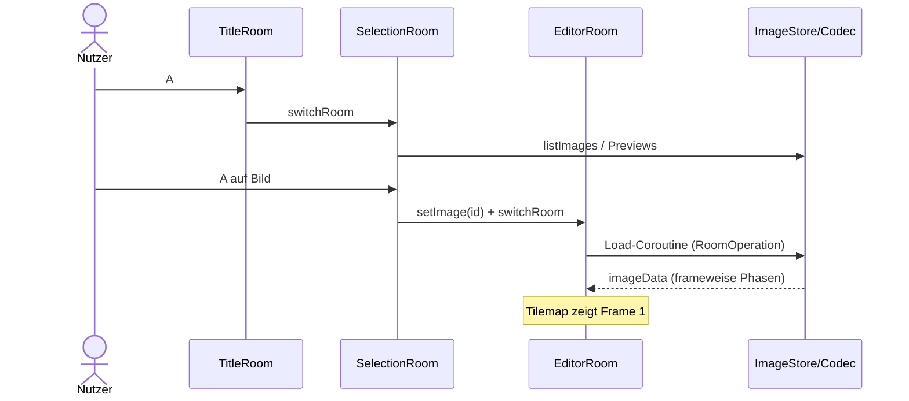
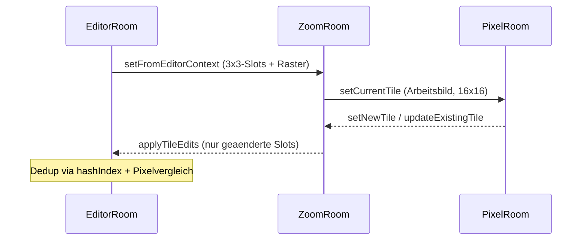
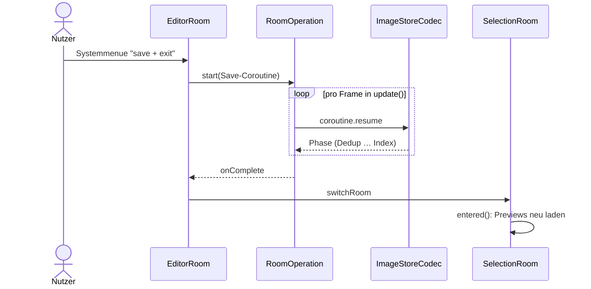

# 6. Laufzeitsicht

Die Diagramme zeigen bewusst nur die architekturrelevanten Interaktionen zwischen den Bausteinen; Schritt-Details stehen in den nummerierten Listen darunter.

## 6.1 Szenario: Spielstart bis Editor

1. Runtime startet und importiert alle Rooms.
2. main.lua setzt TitleRoom als currentRoom und registriert Input-Handler.
3. A in TitleRoom wechselt zum SelectionRoom (Einbahnstrasse: kein Weg zurueck zum Splash).
4. Nutzer waehlt ein bestehendes Bild oder erstellt ein neues (A auf Neu-Eintrag oder Systemmenue; Namenseingabe ueber das SDK-Keyboard, Commit/Abbruch via keyboardWillHideCallback).
5. SelectionRoom ruft EditorRoom:setImage(id) und wechselt zum EditorRoom.
6. entered() startet die Load-Operation (ImageStoreCodec.newLoadOperation) als RoomOperation mit loadingBar; Phasen: Frames lesen, Bilddaten lesen, Slicing, Validierung.
7. Nach Erfolg steht imageData (imagetable, frames, hashIndex) bereit; die Tilemap zeigt Frame 1, Cursor und Frame-Anzeige sind sichtbar.
8. Bei Ladefehlern kehrt der EditorRoom ohne Absturz zum SelectionRoom zurueck.

Ergebnis: Der Editor ist direkt nach der Bildauswahl aktiv — ohne zwischengeschaltete Room-Auswahl (FR-001).

## 6.2 Szenario: Tileweise malen im EditorRoom

1. Nutzer bewegt den Cursor mit dem D-Pad (Halten wiederholt via SDK-keyRepeatTimer).
2. Der A-Druck startet einen Strich und legt dessen Malwert fest: Zelle zeigt bereits das aktive Zeichen-Tile (bzw. Schwarz ohne Auswahl) -> der Strich malt Weiss (Radierer); sonst malt er das Zeichen-Tile (bzw. Schwarz).
3. Solange A gehalten bleibt, malt jede Cursor-Bewegung die neu betretene Zelle mit demselben Strichwert; A-Release beendet den Strich.
4. Kurzes B (Release ohne Zoom-Ticks) uebernimmt das Tile unter dem Cursor als aktives Zeichen-Tile (Pipette); Pipette auf Weiss waehlt ab.
5. Jede Mutation schreibt frames[currentFrame] und aktualisiert die Tilemap per setTileAtPosition; needsRedraw steuert das Zeichnen.

Ergebnis: Der Frame-Zustand ist visuell aktuell und liegt vollstaendig in imageData vor.

## 6.3 Szenario: Animationsframes per Crank

1. Crank vorwaerts (eine Rastung, getCrankTicks(4)) wechselt zum naechsten Frame; existiert keiner und sind < 12 vorhanden, entsteht er als flache Kopie des aktuellen.
2. Crank rueckwaerts wechselt einen Frame zurueck; auf Frame 1 rotiert die Navigation zum letzten existierenden Frame (rueckwaerts entstehen nie Frames).
3. Bei 12 Frames rotiert vorwaerts zu Frame 1.
4. Mehrere Rastungen pro Update werden sequenziell abgearbeitet; jede Kopie basiert auf ihrem direkten Vorgaenger.
5. Frame-Wechsel = tilemap:setTiles(frames[f], 25) + Redraw; die Bauchbinde zeigt "Frame n/m".
6. "delete frame" im Systemmenue entfernt den aktiven Frame (Nachruecker wird aktiv); beim letzten verbliebenen Frame wirkungslos.

Ergebnis: Bis zu 12 Frames sind vollstaendig per Crank erstell-, durchlauf- und loeschbar (FR-006..FR-008a).

## 6.4 Szenario: Zoomkette EditorRoom -> ZoomRoom -> PixelRoom

1. Im EditorRoom wird B gehalten und der Crank-Trigger erreicht (Tick-Akkumulation); waehrend B gehalten ist, loest der Crank keine Frame-Wechsel aus.
2. EditorRoom baut den 3x3-Kontext um den Cursor (Slots mit frameIndexPos/originalIndex/originalImage, 24x24-gridState per 2x2-Blockauslese, showGrid, imageData-Referenz) und uebergibt ihn an ZoomRoom.
3. ZoomRoom rendert das 24x24-Malraster; ein Malstrich setzt genau einen 2x2-Pixelblock; out-of-bounds-Slots sind nicht editierbar.
4. B+Crank vorwaerts oeffnet den PixelRoom mit dem Arbeitsbild des Cursor-Slots in echten 16x16 Pixeln; ein Malstrich setzt genau 1 Pixel.
5. PixelRoom-Rueckgabe: Standardpfad als bearbeitetes Tile (setNewTile) oder "All Similar" in-place in die Imagetable (updateExistingTile, wirkt auf alle Verwendungen ueber alle Frames).
6. B+Crank rueckwaerts im ZoomRoom committet nur tatsaechlich geaenderte Slots an EditorRoom:applyTileEdits (Dedup: hashIndex-Treffer + Pixelvergleich oder neues Tile) und kehrt zurueck; geschrieben wird ausschliesslich der aktive Frame.

Ergebnis: Pixelgenaue Aenderungen ueber alle drei Stufen; unveraenderte Slots erzeugen keine neuen Tiles (Z-03).

## 6.5 Szenario: Autosave beim Verlassen

1. Nutzer waehlt im Systemmenue des EditorRoom "save + exit".
2. EditorRoom startet eine RoomOperation mit ImageStoreCodec.newSaveOperation; Eingaben (inkl. Menueaktionen) sind blockiert.
3. Phasen: Dedup, Sheet, Frames, Bilddaten, Preview, Index (Index als letzte Phase, C-06); loadingBar zeigt Titel und Phase.
4. Nach Erfolg wechselt der EditorRoom zum SelectionRoom; dessen entered() laedt die Previews neu (aktualisiertes Thumbnail).
5. Bei Fehlern bleibt der Editor bedienbar und zeigt einen Fehlerstatus; kein Datenverlust im Speicher.
6. Zusaetzlich speichert playdate.gameWillTerminate() das offene Bild; aktive Zoomstufen committen zuvor ihren Slot-Zustand (PixelRoom -> ZoomRoom -> EditorRoom).

Ergebnis: Verlassen und Beenden speichern automatisch; der Auswahlscreen zeigt den aktuellen Stand (FR-014).

## 6.6 Fehler-/Ausnahmeszenarien

- Fehlende/ungueltige Save-Dateien beim Laden: Load-Operation endet defensiv; Rueckkehr zum SelectionRoom ohne Absturz.
- Ungueltige Tile-Referenzen in frames.json: Validierung faellt auf das Weiss-Tile zurueck.
- Fehler in laufender RoomOperation: Overlay zeigt Fehlerstatus; der Room raeumt seine Operationsreferenz auf und bleibt stabil bedienbar.
- Keyboard-Abbruch bei Bild-Anlage im SelectionRoom: keine Neuerstellung, Grid wird sauber aktualisiert (keyboardWillHideCallback(false)).
- Namenskollision bei der Anlage: automatischer Suffix-Retry (name-1, name-2, …) statt Fehlermeldung.
- Eingaben waehrend laufender Save-/Load-Operation: blockiert (inkl. Systemmenue-Aktionen des EditorRoom).
- Defekte frames.json beim Laden: Frames falscher Laenge werden verworfen (ohne Luecken in der Frame-Liste); sind alle Frames defekt, wird ein weisser Leerframe erzeugt — der Editor setzt frames[1] voraus.
- Navigation im SelectionRoom ausserhalb vorhandener Eintraege: Selektion klemmt am letzten Eintrag (kein Fehler, kein Leerlauf).

## 6.7 Szenario: Offline-Import PNG (Tools/Importer, historisch)

Das Browser-Tool importiert PNGs in Pulp-JSON-Dokumente (v0.2-Format) und ist mit dem v0.3.0-Speicherformat nicht kompatibel (R-14). Der Ablauf bleibt dokumentiert, weil das Tool weiterhin im Repository liegt: JSON laden -> PNG normalisieren (200x120) -> 8x8-Slicing + FNV-1a-Dedupe -> neuer Room -> Export als neue Datei.
