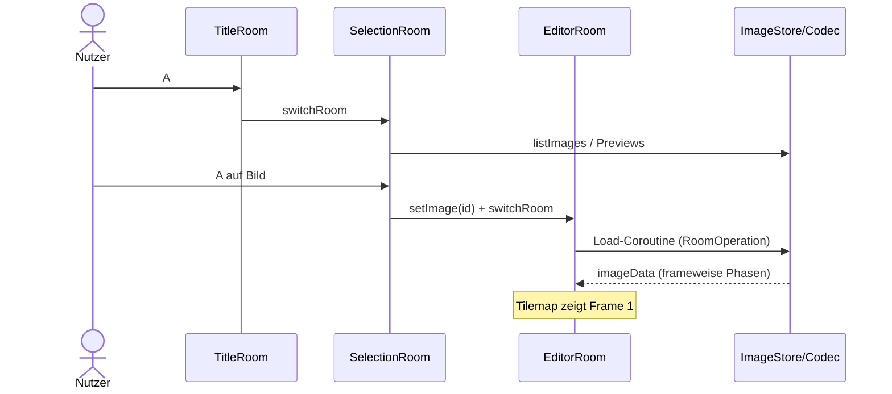
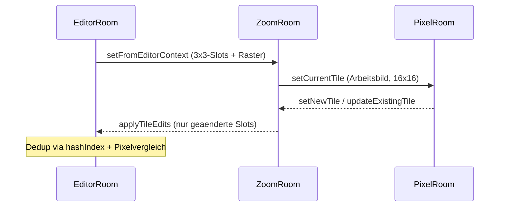
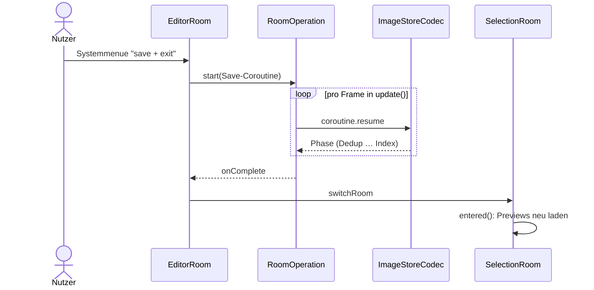
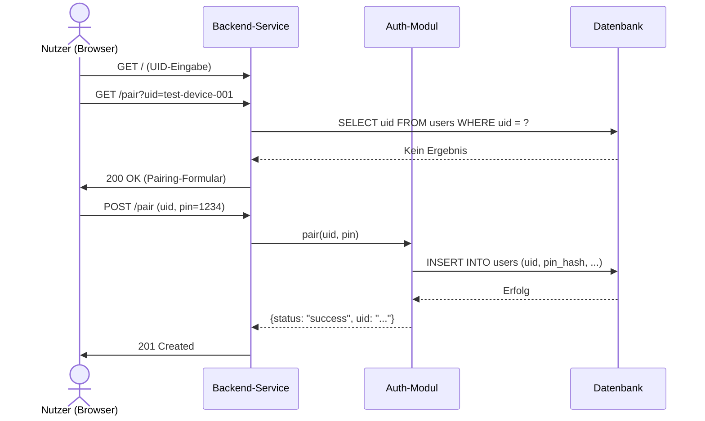
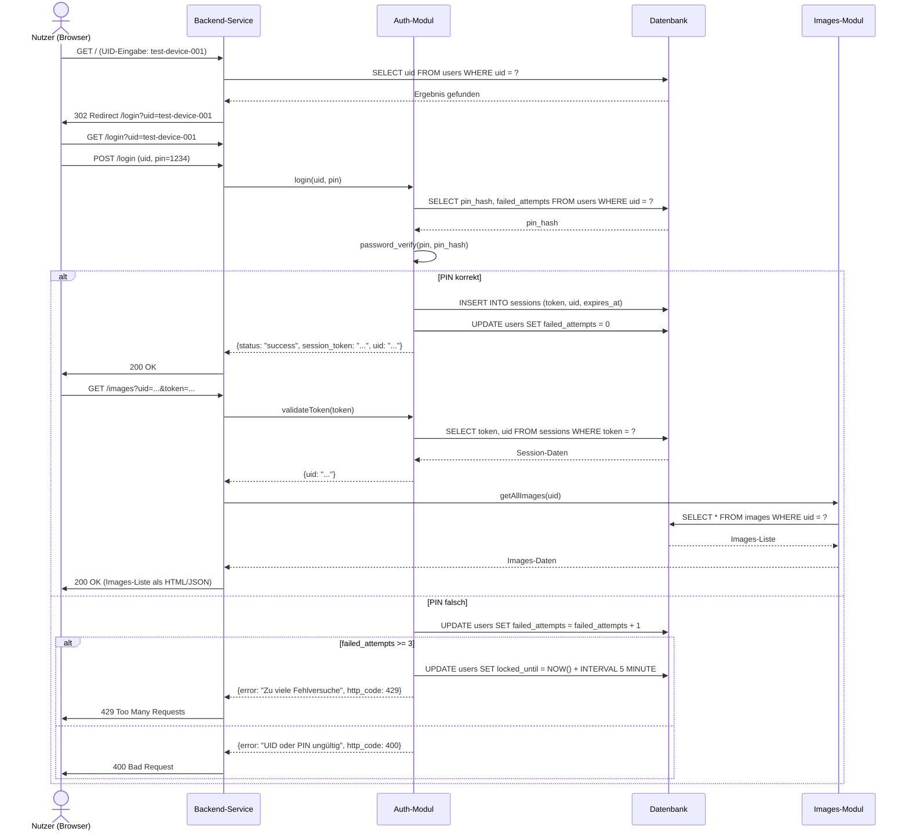
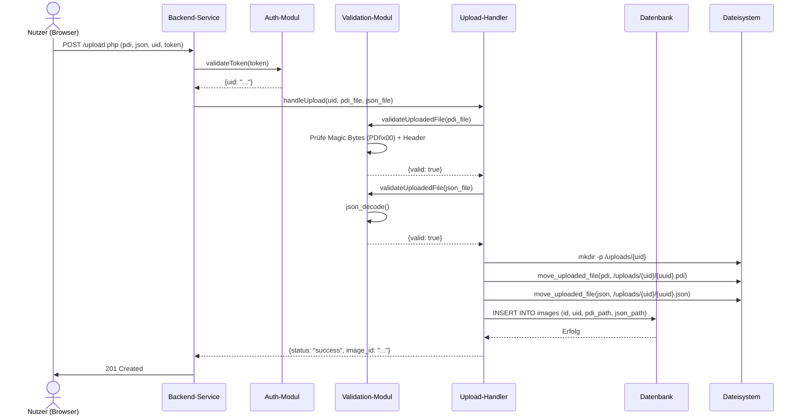
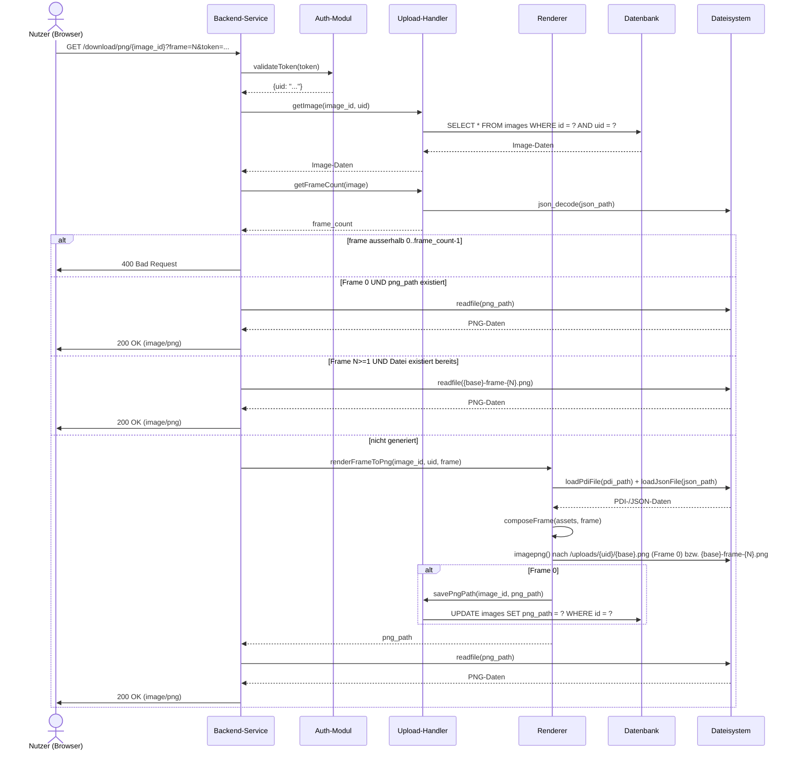
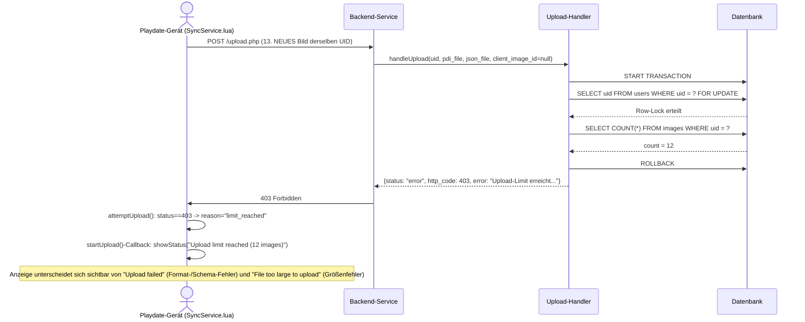
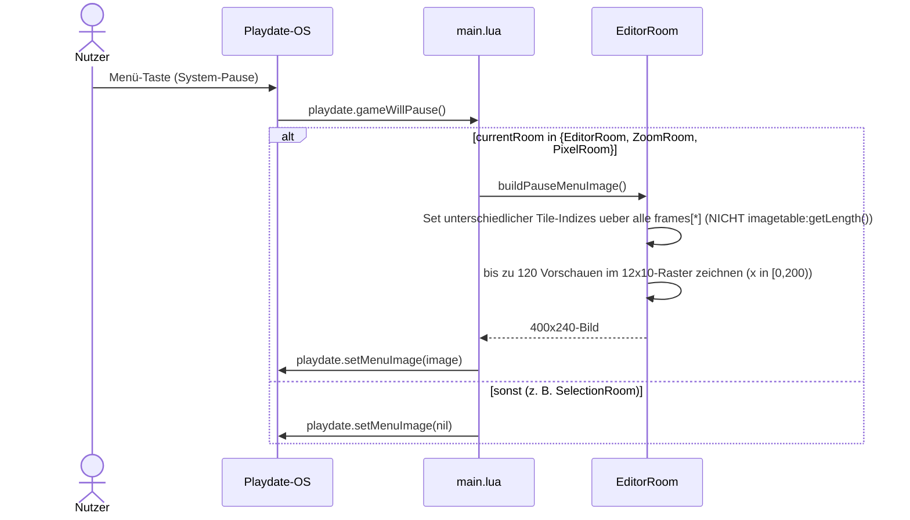

# 6. Laufzeitsicht

Die Diagramme zeigen bewusst nur die architekturrelevanten Interaktionen zwischen den Bausteinen; Schritt-Details stehen in den nummerierten Listen darunter.

## 6.1 Szenario: Spielstart bis Editor

1. Runtime startet und importiert alle Rooms.
2. main.lua setzt TitleRoom als currentRoom und registriert Input-Handler.
3. A in TitleRoom wechselt zum SelectionRoom (Einbahnstrasse: kein Weg zurueck zum Splash).
4. Nutzer waehlt ein bestehendes Bild oder erstellt ein neues (A auf Neu-Eintrag oder Systemmenue; Namenseingabe ueber das SDK-Keyboard, Commit/Abbruch via keyboardWillHideCallback).
5. SelectionRoom ruft EditorRoom:setImage(id) und wechselt zum EditorRoom.
6. entered() startet die Load-Operation (ImageStoreCodec.newLoadOperation) als RoomOperation mit loadingBar; Phasen: Frames lesen, Bilddaten lesen, Slicing, Validierung.
7. Nach Erfolg steht imageData (imagetable, frames, hashIndex) bereit; die Tilemap zeigt Frame 1, Cursor und Frame-Anzeige sind sichtbar.
8. Bei Ladefehlern kehrt der EditorRoom ohne Absturz zum SelectionRoom zurueck.

Ergebnis: Der Editor ist direkt nach der Bildauswahl aktiv — ohne zwischengeschaltete Room-Auswahl (FR-001).

## 6.2 Szenario: Tileweise malen im EditorRoom

1. Nutzer bewegt den Cursor mit dem D-Pad (Halten wiederholt via SDK-keyRepeatTimer).
2. Der A-Druck startet einen Strich und legt dessen Malwert fest: Zelle zeigt bereits das aktive Zeichen-Tile (bzw. Schwarz ohne Auswahl) -> der Strich malt Weiss (Radierer); sonst malt er das Zeichen-Tile (bzw. Schwarz).
3. Solange A gehalten bleibt, malt jede Cursor-Bewegung die neu betretene Zelle mit demselben Strichwert; A-Release beendet den Strich.
4. Kurzes B (Release ohne Zoom-Ticks) uebernimmt das Tile unter dem Cursor als aktives Zeichen-Tile (Pipette); Pipette auf Weiss waehlt ab.
5. Jede Mutation schreibt frames[currentFrame] und aktualisiert die Tilemap per setTileAtPosition; needsRedraw steuert das Zeichnen.

Ergebnis: Der Frame-Zustand ist visuell aktuell und liegt vollstaendig in imageData vor.

## 6.3 Szenario: Animationsframes per Crank

**Aktualisiert in Spec 006** (R1): Frame-Wechsel erfordert seit Spec 006 eine
volle 360°-Umdrehung ab der aktuellen Kurbelposition statt der fruehreren
90°-Rasterung — verhindert ungewollte Wechsel durch Antippen/Einklappen.

1. Ohne gehaltene B-Taste liest handleCrank() pro update() playdate.getCrankChange() (Grad-Delta seit dem letzten Aufruf) und summiert es signiert in crankAccumDegrees; kein Reset auf 0 bei Richtungswechsel.
2. Erreicht crankAccumDegrees >= 360, wechselt die Navigation vorwaerts zum naechsten Frame (Akkumulator um 360 korrigiert, nicht auf 0 zurueckgesetzt); existiert keiner und sind < 12 vorhanden, entsteht er als flache Kopie des aktuellen.
3. Erreicht crankAccumDegrees <= -360, wechselt sie rueckwaerts einen Frame zurueck; auf Frame 1 rotiert die Navigation zum letzten existierenden Frame (rueckwaerts entstehen nie Frames).
4. Teildrehungen (< 360° netto) und Richtungswechsel vor Erreichen der Schwelle aendern den angezeigten Frame NICHT — der Akkumulator bleibt bis zur naechsten Kurbelbewegung stehen (auch beim Einklappen mitten in der Drehung).
5. Bei 12 Frames rotiert vorwaerts zu Frame 1.
6. Frame-Wechsel = tilemap:setTiles(frames[f], 25) + Redraw; die Bauchbinde zeigt "Frame n/m" (sofern nicht wegen Inaktivitaet ausgeblendet, siehe 6.10).
7. Mit gehaltener B-Taste bleibt der Pfad UNVERAENDERT: getCrankTicks(4) treibt weiterhin ausschliesslich die Zoomkette (siehe 6.4). CR-01 praezisiert (AD-047): pro update() **steuert** genau eine der beiden Crank-Lese-APIs die Logik (B-Zweig getCrankTicks, Ohne-B-Zweig getCrankChange) — **beide werden aber jeden Frame einmal gelesen**, der nicht genutzte Wert wird verworfen (Drain des zustandsbehafteten SDK-Zaehlers, sonst Phantom-Zoom beim ersten B-Frame; Regressionsschutz fuer die Zoomkette bleibt).
8. "clear screen" im Systemmenue (Spec 008, AD-037, ersetzt seit Spec 008 "reset frame"/AD-032 vollstaendig) setzt alle 375 Tile-Indizes des aktiven Frames auf den Voll-Weiss-Basisindex 1; andere Frames bleiben unberuehrt (siehe 6.15).

Ergebnis: Bis zu 12 Frames sind per Crank erstell- und durchlaufbar, ausschliesslich durch volle Umdrehungen ausgeloest (FR-004..FR-006), und per "clear screen" vollstaendig leerbar (Spec 008, FR-011..FR-015).

## 6.4 Szenario: Zoomkette EditorRoom -> ZoomRoom -> PixelRoom

1. Im EditorRoom wird B gehalten und der Crank-Trigger erreicht (Tick-Akkumulation); waehrend B gehalten ist, loest der Crank keine Frame-Wechsel aus.
2. EditorRoom baut den 3x3-Kontext um den Cursor (Slots mit frameIndexPos/originalIndex/originalImage, 24x24-gridState per 2x2-Blockauslese, showGrid, imageData-Referenz) und uebergibt ihn an ZoomRoom.
3. ZoomRoom rendert das 24x24-Malraster; ein Malstrich setzt genau einen 2x2-Pixelblock; out-of-bounds-Slots sind nicht editierbar.
4. B+Crank vorwaerts oeffnet den PixelRoom mit dem Arbeitsbild des Cursor-Slots in echten 16x16 Pixeln; ein Malstrich setzt genau 1 Pixel.
5. PixelRoom-Rueckgabe: Standardpfad als bearbeitetes Tile (setNewTile) oder "All Similar" in-place in die Imagetable (updateExistingTile, wirkt auf alle Verwendungen ueber alle Frames).
6. B+Crank rueckwaerts im ZoomRoom committet nur tatsaechlich geaenderte Slots an EditorRoom:applyTileEdits (Dedup: hashIndex-Treffer + Pixelvergleich oder neues Tile) und kehrt zurueck; geschrieben wird ausschliesslich der aktive Frame.

Ergebnis: Pixelgenaue Aenderungen ueber alle drei Stufen; unveraenderte Slots erzeugen keine neuen Tiles (Z-03).

## 6.5 Szenario: Autosave beim Verlassen

1. Nutzer waehlt im Systemmenue des EditorRoom "save + exit".
2. EditorRoom startet eine RoomOperation mit ImageStoreCodec.newSaveOperation; Eingaben (inkl. Menueaktionen) sind blockiert.
3. Phasen: Dedup, Sheet, Frames, Bilddaten, Preview, Index (Index als letzte Phase, C-06); loadingBar zeigt Titel und Phase. Seit Spec 009 entfernt die Dedup-Phase zusaetzlich alle ueber keinen Frame mehr referenzierten Tiles (ausser den Basistiles) und nummeriert die verbleibenden neu (pruneUnusedTiles(), AD-005) — die Folgephasen verarbeiten bereits den bereinigten Stand.
4. Nach Erfolg wechselt der EditorRoom zum SelectionRoom; dessen entered() laedt die Previews neu (aktualisiertes Thumbnail).
5. Bei Fehlern bleibt der Editor bedienbar und zeigt einen Fehlerstatus; kein Datenverlust im Speicher.
6. Zusaetzlich speichert playdate.gameWillTerminate() das offene Bild; aktive Zoomstufen committen zuvor ihren Slot-Zustand (PixelRoom -> ZoomRoom -> EditorRoom).

Ergebnis: Verlassen und Beenden speichern automatisch; der Auswahlscreen zeigt den aktuellen Stand (FR-014).

## 6.6 Fehler-/Ausnahmeszenarien

- Fehlende/ungueltige Save-Dateien beim Laden: Load-Operation endet defensiv; Rueckkehr zum SelectionRoom ohne Absturz.
- Ungueltige Tile-Referenzen in frames.json: Validierung faellt auf das Weiss-Tile zurueck.
- Fehler in laufender RoomOperation: Overlay zeigt Fehlerstatus; der Room raeumt seine Operationsreferenz auf und bleibt stabil bedienbar.
- Keyboard-Abbruch bei Bild-Anlage im SelectionRoom: keine Neuerstellung, Grid wird sauber aktualisiert (keyboardWillHideCallback(false)).
- Namenskollision bei der Anlage: automatischer Suffix-Retry (name-1, name-2, …) statt Fehlermeldung.
- Eingaben waehrend laufender Save-/Load-Operation: blockiert (inkl. Systemmenue-Aktionen des EditorRoom).
- Defekte frames.json beim Laden: Frames falscher Laenge werden verworfen (ohne Luecken in der Frame-Liste); sind alle Frames defekt, wird ein weisser Leerframe erzeugt — der Editor setzt frames[1] voraus.
- Navigation im SelectionRoom ausserhalb vorhandener Eintraege: Selektion klemmt am letzten Eintrag (kein Fehler, kein Leerlauf).

## 6.7 Szenario: Offline-Import PNG (Tools/Importer, historisch)

Das Browser-Tool importiert PNGs in Pulp-JSON-Dokumente (v0.2-Format) und ist mit dem v0.3.0-Speicherformat nicht kompatibel (R-14). Der Ablauf bleibt dokumentiert, weil das Tool weiterhin im Repository liegt: JSON laden -> PNG normalisieren (200x120) -> 8x8-Slicing + FNV-1a-Dedupe -> neuer Room -> Export als neue Datei.

---

## 6.8 Backend-Szenarien (Hans Dither Sync)

### 6.8.1 Szenario: UID-Verknüpfung (Pairing)

1. Nutzer gibt UID in das Formular auf der Startseite ein
2. Backend prüft, ob UID bereits existiert
3. Wenn nicht: Pairing-Formular mit PIN-Eingabe wird angezeigt
4. Nutzer gibt 4-stellige PIN ein
5. Backend: PIN wird mit bcrypt gehasht und in DB gespeichert
6. Erfolgmeldung wird zurückgegeben

**Ergebnis:** UID ist mit PIN verknüpft, Nutzer kann sich anmelden.

### 6.8.2 Szenario: Login und Images-Liste

1. Nutzer gibt bestehende UID ein
2. Backend erkennt UID und leitet zu Login weiter
3. Nutzer gibt PIN ein
4. Backend verifiziert PIN mit bcrypt
5. Bei Erfolg: Session-Token wird generiert und gespeichert
6. Nutzer wird zur Images-Liste weitergeleitet
7. Session-Token wird für alle folgenden Requests verwendet

**Ergebnis:** Nutzer ist authentifiziert und sieht seine Images.

### 6.8.3 Szenario: PDI + JSON Upload

1. Nutzer wählt PDI- und JSON-Datei im Upload-Formular aus
2. Backend prüft Session-Token
3. PDI-Datei wird validiert: Magic Bytes + Header-Parse
4. JSON-Datei wird validiert: json_decode() muss erfolgreich sein
5. Dateien werden unter `/uploads/{UID}/{uuid}.pdi` und `.json` gespeichert
6. DB-Eintrag wird erstellt
7. Erfolgmeldung mit Image-ID wird zurückgegeben

**Ergebnis:** PDI + JSON sind hochgeladen und in DB registriert.

### 6.8.4 Szenario: Frame-/Tilemap-PNG Download (on-demand Rendering, Spec 009)

1. Nutzer klickt auf einen der Frame-Vorschau-/Downloadlinks in der Galerie (`?frame=N`, 0-basiert, spec.md Clarifications).
2. Backend prüft Session-Token und Berechtigung, danach die Frame-Anzahl (`UploadHandler::getFrameCount()`, aus frames.json abgeleitet, kein DB-Feld) — `frame` ausserhalb `0..frame_count-1` → `400 Bad Request`.
3. Frame 0: weiterhin über die `png_path`-Spalte gecacht (unverändertes Verhalten). Frame ≥ 1: rein dateisystembasiert über den deterministischen Pfad `{base}-frame-{N}.png` (`{base}` = `client_image_id` oder Fallback auf die interne ID) — kein DB-Feld nötig.
4. Falls die Datei noch nicht existiert: PDI + JSON werden geparst, der angeforderte Frame wird zusammengesetzt und als PNG geschrieben.
5. **Tilemap-PNG** (`GET /download/tilemap/{image_id}`, analoger Ablauf ohne `frame`-Parameter): `Renderer::renderTilemapToPng()` schreibt die aus `sheet.pdi` geparsten Roh-Pixelzeilen 1:1 als PNG unter `{base}-table-16-16.png` (Playdate-SDK-Namenskonvention für Matrix-Imagetables) — kein Tile-Slicing nötig.
6. **PDI-Download entfällt** (Spec 009 FR-012/013): `GET /download/pdi/{image_id}` liefert `410 Gone` statt der Rohdatei; die interne PDI-Nutzung fürs Rendering (Schritt 4) ist davon unberührt.

**Ergebnis:** Nutzer erhält die gewünschte Frame- oder Tilemap-PNG (generiert on-demand beim ersten Zugriff); die frühere PDI-Rohdatei ist nicht mehr über die Nutzer-Oberfläche/API erreichbar.

## 6.9 Szenario: Upload-Limit erreicht (Spec 007, Ende-zu-Ende bis zur Geräte-Anzeige)

Ergänzt 6.8.3 um den neuen, race-sicheren Zähl-Check (ADR-033) UND zeigt
— anders als 6.8.3 — den vollständigen Pfad bis zur Playdate-Anzeige, da
eine rein backend-interne Betrachtung FR-002/SC-005 nicht abdecken würde
(research.md R6 der Spec 007-Planung: eine korrekte 403-Antwort allein
genügt nicht, wenn der Client sie nicht unterscheidbar anzeigt).

1. Gerät versucht ein 13. (neues, dem Backend unbekanntes) Bild hochzuladen
2. `UploadHandler` öffnet eine Transaktion und sperrt den `users`-Datensatz
   der UID (`FOR UPDATE`) — serialisiert gegen gleichzeitige Requests
   derselben UID (FR-011)
3. `COUNT(*) FROM images WHERE uid = ?` liefert 12 (Limit bereits erreicht)
4. Transaktion wird zurückgerollt (kein Datei-Schreibvorgang, keine
   DB-Änderung), Backend antwortet mit `403 Forbidden`
5. `Source/SyncService.lua` bildet den `403`-Status auf einen eigenen
   internen Grund (`reason = "limit_reached"`) ab — NICHT auf den
   generischen `upload_failed`-Zweig
6. Das Gerät zeigt eine eigene, von anderen Fehlermeldungen unterscheidbare
   Meldung ("Upload limit reached (12 images)") statt "Upload failed"

**Gegenprobe (Update-in-place, FR-003):** Ist `client_image_id` eines der
12 bereits bekannten Bilder, liefert die `SELECT id FROM images WHERE uid
= ? AND client_image_id = ?`-Abfrage (Schritt 4a in `handleUpload()`)
einen Treffer — der Zähl-Check in Schritt 4b wird dann übersprungen, der
Upload läuft trotz erreichtem Limit als Aktualisierung durch (`201`).

**Ergebnis:** Das Limit ist race-sicher durchgesetzt UND der Grund der
Ablehnung ist auf dem Gerät erkennbar, nicht nur im HTTP-Response-Body.

## 6.10 Szenario: Bauchbinden-Inaktivitäts-Timer (Spec 006, US3)

1. Jede tatsächliche Eingabe (D-Pad, A, B, Crank-Delta ≠ 0 — beide
   Crank-Lesepfade aus 6.3) setzt `lastActivityMs =
   playdate.getCurrentTimeMilliseconds()`.
2. `EditorRoom:update()` vergleicht bei JEDEM Aufruf `(nowMs -
   lastActivityMs) < 5000` gegen den zuletzt bekannten Sichtbarkeitszustand;
   ändert sich dieser (sichtbar ↔ unsichtbar), wird `needsRedraw = true`
   gesetzt — sonst würde die Bauchbinde bei reiner Inaktivität nie
   tatsächlich verschwinden, da `draw()` nur bei `needsRedraw == true`
   läuft (analog zum bestehenden `statusMessage`-Timeout-Muster).
3. `draw()` zeichnet die Frame-Positions-Bauchbinde nur, wenn sichtbar, auf
   der Bildschirmhälfte GEGENÜBER dem Cursor (`cursor.x <= 12` →
   `"right"`, sonst `"left"`).
4. Die separate Status-Bauchbinde (Fehlertexte, immer `"left"`) bleibt
   unverändert und unabhängig von dieser Logik.

**Ergebnis:** Die Bauchbinde blendet spätestens 5s nach der letzten
Eingabe zuverlässig aus, erscheint bei jeder neuen Eingabe sofort wieder,
und verdeckt nie den aktiven Arbeitsbereich (FR-001..FR-003).

## 6.11 Szenario: Pause-Bild-Aufbau bei gameWillPause (Spec 006, US5, AD-031)

1. Der Bildaufbau läuft AUSSCHLIESSLICH beim tatsächlichen Pausieren, nicht
   pro Frame — kein Performance-Risiko trotz Iteration über alle
   Frame-Daten.
2. Die Gesamtzahl unterschiedlicher Tiles wird frisch durch Iteration über
   `imageData.frames[*]` als Set berechnet, NICHT aus
   `imagetable:getLength()` übernommen (könnte nicht mehr referenzierte
   Alt-Einträge mitzählen).
3. Übersteigt die Gesamtzahl 120, zeigt das Raster nur die ersten 120
   (aufsteigender Tile-Index); die separat ausgewiesene Gesamtzahl bleibt
   davon unberührt vollständig korrekt.
4. Der gesamte informationstragende Inhalt liegt in `x ∈ [0, 200)`, da die
   rechte Bildhälfte vom System-Menü überdeckt wird (SDK-Vorgabe).

**Ergebnis:** Pausiert der Nutzer im Editor/einer Zoomstufe, zeigt das
System-Pause-Menü zusätzlich zu Volume/Home/Screenshot eine Tile-Übersicht
mit korrekter Gesamtzahl und Frame-Anzahl (FR-010..FR-013).

## 6.12 Szenario: Titelscreen-Vollbild-Animation (Spec 006, US6, R6)

1. Bei jedem Selektionswechsel im `SelectionRoom` prüft `setSelectedIndex()`,
   ob die neue Auswahl von `fullImageForId` abweicht; falls ja, wird ein
   laufender Ladevorgang für den VERLASSENEN Eintrag einfach nicht mehr
   resumed (reiner Lesevorgang ohne Seiteneffekt, kein Cancel-Callback
   nötig) und ein neuer `RoomOperation`-Ladevorgang über
   `ImageStoreCodec.newLoadOperation(id)` für den neuen Eintrag gestartet
   (stiller Overlay ohne sichtbare loadingBar).
2. Solange `fullImageData == nil` bleibt das bestehende statische
   Kreis-Thumbnail für diesen Eintrag sichtbar — kein Leerbild, kein
   Sprung.
3. Nach Abschluss baut `SelectionRoom` ein `gfx.tilemap` aus der vollen
   Imagetable auf und zeichnet es VOR dem Gridview vollflächig (400×240);
   `drawCell()` lässt die Zelle dieses Eintrags frei, damit der
   Vollbild-Hintergrund nicht übermalt wird — alle anderen Zellen bleiben
   exakt wie zuvor.
4. Ein zeitlich wechselnder Muster-Overlay (`gfx.setPattern` mit
   Phasenwechsel — KORRIGIERT gegenüber der ursprünglichen Annahme
   `gfx.setDitherPattern`, das keinen Phasen-Offset besitzt, siehe
   research.md R5) wird über dem Vollbild-Hintergrund gezeichnet; danach
   wird `gfx.setColor()` zurückgesetzt, da `setPattern`/`setColor` laut
   SDK-Doku exklusiv sind.
5. Bei genau 1 Frame läuft kein Frame-Wechsel-Timer; `titleAnimFrame`
   bleibt dauerhaft `1`, der Muster-Effekt bleibt trotzdem aktiv.

**Ergebnis:** Der aktuell selektierte Eintrag zeigt seine Animation
vollflächig mit Störeffekt, ohne den Editor zu öffnen; alle anderen
Einträge bleiben unverändert als Kreise erkennbar (FR-016..FR-018).

## 6.13 Szenario: Zoom-Room-Redraw über Hintergrund-Cache (Spec 008, US1, AD-035)

1. Beim Betreten des Zoom Room bzw. nach `setFromEditorContext()`/
   `setNewTile()`/`updateExistingTile()` wird `backgroundDirty = true`
   gesetzt (`showGridLines` selbst wird ausschließlich innerhalb von
   `setFromEditorContext()` gesetzt, es gibt keinen separaten Live-Toggle
   innerhalb einer laufenden Zoom-Room-Sitzung — **korrigiert gegenüber der
   ursprünglichen Planung**, siehe data-model.md).
2. Vor dem nächsten Redraw baut `ZoomRoom` — falls `backgroundDirty` oder
   `cachedBackground == nil` — den kompletten statischen Hintergrund
   (Checkerboard-Seiten, alle 576 Zellen im unbearbeiteten Subpixel-
   Zustand, gestrichelte Zell- und durchgezogene Tile-Grenzen) EINMALIG in
   `cachedBackground` (`gfx.pushContext`/`gfx.popContext`); danach
   `changedCells = {}`, `backgroundDirty = false`.
3. Cursorbewegung oder ein Malstrich lösen `needsRedraw = true` aus wie
   bisher; `paintCurrentCell()` trägt die betroffene Zelle zusätzlich in
   `changedCells` ein.
4. Der eigentliche Redraw blittet `cachedBackground` (ein Aufruf statt
   Hunderter Einzel-Draws), übermalt nur die Zellen aus `changedCells`
   flächig gemäß `gridState`, und zeichnet zuletzt den Cursor.
5. Editier-/Commit-Logik (`beginStroke`, `collectEdits`, Dedup-Pfad) bleibt
   vollständig unverändert — nur der Zeichenweg wurde ersetzt.

**Ergebnis:** Cursorbewegung und Malen im Zoom Room reagieren ohne
wahrnehmbare Verzögerung, auch bei durchgehend gehaltener Richtungstaste
über mehrere Sekunden (FR-001..FR-004, SC-001/SC-002); objektiv
nachgewiesen über `playdate.getStats()`/Sampler vor/nach dem Fix
(quickstart.md Szenario 1).

## 6.14 Szenario: Pixel-Rotation per Crank-Volldrehung (Spec 008, US2, AD-036)

1. Ohne gehaltene B-Taste liest `PixelRoom:update()` pro Aufruf
   `playdate.getCrankChange()` und summiert es signiert in
   `rotationAccumDegrees` — analog zu `crankAccumDegrees` in `EditorRoom`
   (6.3), aber als eigenständiger Zustand innerhalb von `PixelRoom`.
2. Erreicht `rotationAccumDegrees >= 360`, wird `gridState` per exaktem
   Index-Remap (`new[r][c] = old[17-c][r]`, 1-indiziert, 16×16) um 90°
   im Uhrzeigersinn rotiert; der Akkumulator wird um 360 korrigiert (FR-005).
3. Erreicht `rotationAccumDegrees <= -360`, rotiert die inverse Formel
   (`new[r][c] = old[c][17-r]`) um 90° gegen den Uhrzeigersinn (FR-006).
4. Teildrehungen (< 360° netto) und Richtungswechsel vor Erreichen der
   Schwelle verändern `gridState` NICHT — identisch zum bereits
   etablierten Verhalten der Frame-Navigation (FR-007).
5. Mit gehaltener B-Taste bleibt der Pfad UNVERÄNDERT: `getCrankTicks(4)`
   treibt weiterhin ausschließlich die Zoom-Out-Geste (6.4). PR-01
   praezisiert (AD-047): pro `update()` **steuert** genau eine der beiden
   Crank-Lese-APIs die Logik (B-Zweig `getCrankTicks`, Ohne-B-Zweig
   `getCrankChange`) — **beide werden aber jeden Frame einmal gelesen**,
   der nicht genutzte Wert verworfen (Drain; sonst loest ein aus der
   Rotation aufgestauter Tick-Rueckstand beim ersten B-Frame faelschlich
   den Zoom-Out aus, Review F1).
6. Die Rotation wirkt ausschließlich auf das offene `gridState`; erst
   beim Verlassen des Pixel Room fließt das Ergebnis über den
   bestehenden `buildTileImage()`/Dedup-Commit-Pfad zurück (FR-008,
   unverändert gegenüber 6.4).

**Ergebnis:** Eine volle Kurbelumdrehung im Pixel Room dreht das aktuelle
Tile exakt um 90° ohne Auflösungsverlust; vier Umdrehungen ergeben wieder
das Ausgangsbild (FR-005..FR-008, SC-003/SC-004).

## 6.15 Szenario: Aktiven Frame per "Clear Screen" leeren (Spec 008, US3, AD-037)

1. Der Nutzer wählt im Systemmenü des Editors den dritten Slot
   `"clear screen"` (ersetzt vollständig den bisherigen Eintrag
   `"reset frame"`, AD-032/Spec 006).
2. `clearCurrentFrame()` setzt jeden der 375 Tile-Indizes des AKTIVEN
   Frames auf den Basis-Index 1 (Voll-Weiß, `ImageStoreCodec`-Invariante);
   andere Frames in `imageData.frames` bleiben unverändert.
3. `updateTilemapFrame()` + `needsRedraw = true` wie bei jeder anderen
   Frame-Änderung.
4. `resetCurrentFrameToPrevious()` existiert im Code NICHT mehr (FR-011)
   — im Unterschied zu `deleteCurrentFrame()` (seit AD-032 bewusst als
   toter Code belassen) wird diese Funktion vollständig entfernt.

**Ergebnis:** Der aktive Frame ist nach einer einzigen Menü-Auswahl
vollständig weiß; Frame-Anzahl, -Reihenfolge und alle anderen Frames
bleiben unangetastet (FR-011..FR-015, SC-006/SC-007).

## 6.16 Szenario: Schütteln → Undo-Dialog → riskante Operation zurücknehmen (Spec 011, AD-044..046)

Ausgangslage: Der Nutzer hat gerade eine der vier riskanten Operationen
ausgeführt (Clear Screen, Frame löschen, 90°-Rotation, Pixel-Verschiebung);
der zugehörige `record*`-Aufruf hat **vor** der Mutation einen
Pre-Zustands-Eintrag in `EditorRoom`s `UndoHistory` gelegt (bei der
Rotation: Snapshot beim ersten `rotateGrid*()`, Eintrag erst beim Commit;
beim Frame löschen: aus `FrameManagementView.deleteMarked()`).

1. In `EditorRoom:update()` bzw. `ZoomRoom:update()` / `PixelRoom:update()`
   wird einmal pro Frame `playdate.readAccelerometer()` gelesen und an
   `EditorRoom:onShakeSample(x, y, z, commitAndReturn?)` gereicht (Zoom/
   Pixel geben ihren `commitAndReturn`-Callback mit).
2. `shakeDetector:feed(x, y, z, getCurrentTimeMilliseconds())` verfolgt die
   `±T`-Peaks. Peak der einen und danach — innerhalb `W` ms — Peak der
   anderen Polarität → **Kante** (`feed → true`), `R` ms Refraktärsperre.
   Ruhiges Halten / einseitige Bewegung / zu langsame Sequenz → keine Kante
   (FR-011).
3. Kante erkannt und `not inputBlocked()` und `not UndoPrompt.isOpen()` →
   `EditorRoom:undoRequest(commitAndReturn?)`:
   a. **Zuerst** `commitAndReturn()` (nur aus Zoom/Pixel): offene Zell-Edits
      committen, den Rotation-Snapshot des PixelRoom über
      `ZoomRoom:setNewTile` → `EditorRoom:recordRotation` in den Verlauf
      geben, `switchRoom(EditorRoom)` — `EditorRoom:entered()` läuft
      vollständig durch (`returnFrame`, `currentFrame` geklemmt).
   b. `entry, reason = undoHistory:peekValid(imageData)` — siebt einen
      Eintrag mit fehlendem Ziel-Frame (FR-006) bzw. ein `deleteFrame` bei
      bereits 12 Frames (`reason = "frame-limit"`, FR-007) aus.
   c. `entry` vorhanden → `UndoPrompt.open(labelFor(entry.op), () ->
      EditorRoom:undoLast())`; `needsRedraw = true`. Kein `entry` →
      `showStatus("cannot undo - frame limit" | "Nothing to undo")`,
      **kein Dialog** (FR-012).
4. Dialog offen: `EditorRoom:draw()` (bzw. Zoom/Pixel) zeichnet zuletzt
   `UndoPrompt.draw()` (zentrierte Box, „Undo <Operation>?" / „(A) Ja" /
   „(B) Nein"). Jeder Input-Callback + Crank-Block der drei Views ist auf
   `UndoPrompt.isOpen()` gegated: D-Pad/Crank wirkungslos, ein zweites
   Schütteln ist folgenlos (`open` ist No-op, FR-013/FR-015).
5. **(B) Nein** → `UndoPrompt.handleB()`: Dialog zu, Verlauf unberührt.
   **(A) Ja** → `UndoPrompt.handleA()`: erst schließen, dann der
   `onConfirm` = `EditorRoom:undoLast()`:
   - `peekValid` liefert den (garantiert anwendbaren) Eintrag;
   - `kind == "deleteFrame"` → `applyDeleteFrameEntry` (`table.insert` in
     `frameLayers` + `frames` an `min(index, n+1)`, `activeLayer` klemmen);
     sonst `applyContentEntry` (`layer.positions[cellIdx] =
     resolvePrevIndex(cell)`; `op == "clear"` → `recompositeCurrentFrame`,
     sonst je Zelle `recompositeCell`) + `updateTilemapFrame()`;
   - `currentFrame` auf den betroffenen Frame; `undoHistory:pop()`;
     `needsRedraw = true`.

**Ergebnis:** Der Zustand entspricht exakt dem Stand von unmittelbar vor
der zurückgenommenen Operation (FR-002); das Ergebnis ist im Tile View
sichtbar (FR-016). Der Verlauf hält weiterhin bis zu 2 ältere Einträge;
nach Bildwechsel / Editor-Verlassen ist er leer (SC-008).

## 6.17 Szenario: Frame-Room betreten, umsortieren, loeschen/duplizieren, verlassen (Spec 010, 8./9. Runde, AD-048)

1. **Tile View**, `EditorRoom:handleCrank()` erkennt B gehalten + Kurbel
   rueckwaerts (`zoomTickAccu <= -ZOOM_TICK_THRESHOLD`) → `openFrameManagementView()`
   setzt `imageData` + aktiven Frame und `switchRoom(frameManagementView)`.
2. `FrameManagementView:entered()`: `bReleasedSinceEnter = false`, `crankAccu = 0`,
   baut `thumbCache[1..n]` (je Frame `imageData.frames[f]` durch ein
   `playdate.graphics.tilemap` in ein Bild), baut das `gridview` (3 Spalten),
   registriert die System-Menuepunkte „delete frame" + „duplicate frame".
3. **Navigieren**: D-Pad bewegt den Raster-Cursor (`moveCursor`, hoch/runter
   = ±3, an den Sequenzenden geklemmt); eine Bewegung hebt eine Markierung auf.
4. **Markieren**: A setzt `marked = cursor` bzw. hebt sie auf (Umschalter).
5. **Umsortieren**: D-Pad bei gesetztem `marked` → `moveMarked`: Links/Rechts
   = ein `swapFrames` + ein `onFramesReindexed({swapped})`; Hoch/Runter =
   bis zu NUM_COLS solche Nachbar-Swaps hintereinander. `frameLayers`,
   `frames` und `thumbCache` bleiben im Gleichschritt; `marked` und `cursor`
   wandern mit.
6. **Loeschen**: System-Menue „delete frame" → `onMenuDelete()` (No-op bei
   1 Frame) setzt `confirmingDelete`; der Dialog schluckt alle Eingaben ausser
   A (`confirmDelete`) und B (`cancelDelete`). `confirmDelete`: tiefe Kopie
   des Cursor-Frames, `table.remove` aus beiden Arrays + `thumbCache`,
   `onFramesReindexed({removed})`, dann `EditorRoom:recordDeleteFrame` (Spec 011).
7. **Duplizieren**: System-Menue „duplicate frame" (No-op bei 12 Frames) →
   tiefe Kopie an `cursor+1` in beiden Arrays + `thumbCache`,
   `onFramesReindexed({inserted})`, `cursor = cursor+1`.
8. **Verlassen**: `FrameManagementView:update()` liest `getCrankTicks(4)` →
   `crankAccu`; bei B nicht gedrueckt → `bReleasedSinceEnter = true`, `crankAccu = 0`;
   bei B gedrueckt **und** `bReleasedSinceEnter` **und** `crankAccu >= EXIT_TICK_THRESHOLD`
   → `returnToEditor()` (`imageData.returnFrame = cursor`, `switchRoom(editorRoom)`).
9. `EditorRoom:entered()` liest `returnFrame`, klemmt `currentFrame`/`activeLayer`
   in die evtl. kuerzere/umgeordnete Sequenz, baut das eigene System-Menue neu.

**Ergebnis:** Frame-Reihenfolge/-Anzahl geaendert; die Spec-011-`UndoHistory`
folgt jeder Struktur-Aenderung ueber `{swapped}` / `{removed}` / `{inserted}`.
Persistenz unveraendert (v1.1).

## 6.18 Szenario: Konsolidierte Overlay-Leiste im Tile View (Spec 010, 8. Runde, AD-049)

1. `EditorRoom:draw()` bestimmt `side` aus `cursor.x` (Spec 006 FR-003) und
   `vAnchor = overlayAnchor(cursor.y, GRID_ROWS)` (obere Cursor-Haelfte →
   Leiste unten, sonst oben; Gleichstand → unten).
2. Ist der Tile-Picker sichtbar, zeichnet `drawTilePickerOverlay(vAnchor)` den
   Filmstreifen in der abgewandten Zone (nicht mehr bildschirmmittig); das
   Frame/Ebenen-Label pausiert solange.
3. Sonst komponiert `draw()` **eine** Zeilenliste (Label bzw. „Tile N picked",
   plus Statustext als zweite Bandzeile) und uebergibt sie an
   `Bauchbinde:draw(lines, side, vAnchor, 400, 240)`. Ist zugleich der Picker
   sichtbar, weicht die Statuszeile auf den gegenueberliegenden Anker aus.
4. `overlay:draw()` und `UndoPrompt.draw()` (Spec 011, eigene modale Schicht)
   folgen zuletzt.

**Ergebnis (SC-008):** In keiner Cursorposition verdeckt ein passives
Overlay-Element die Cursor-Zelle; keine zwei Elemente ueberzeichnen sich.
